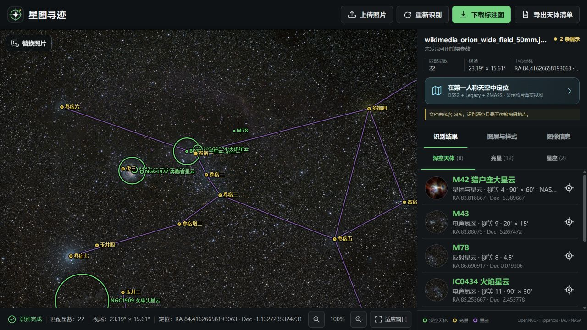
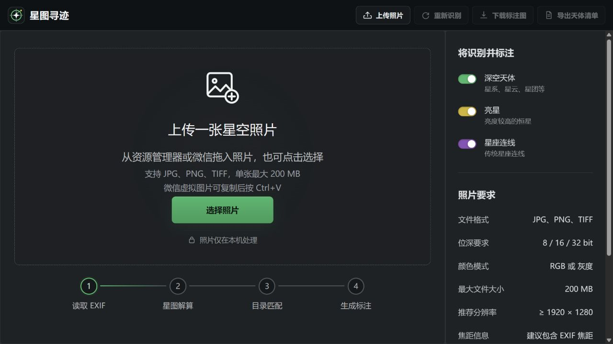
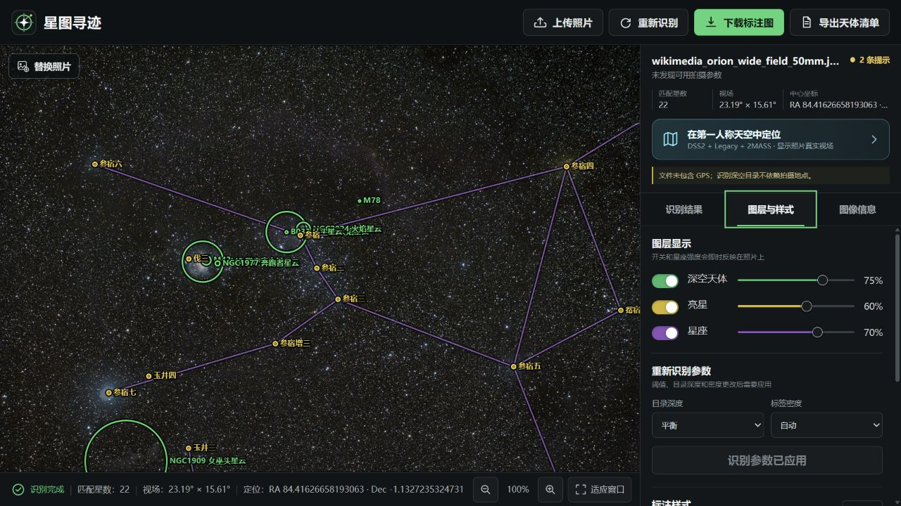
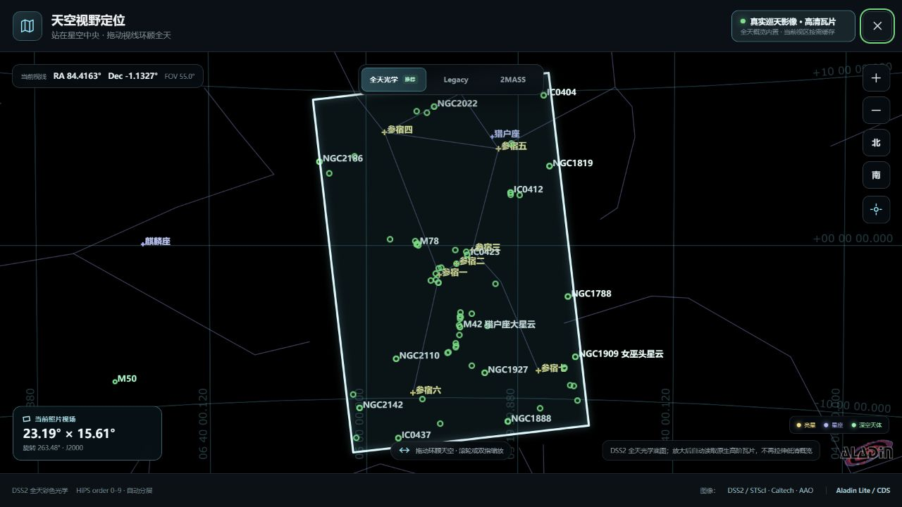
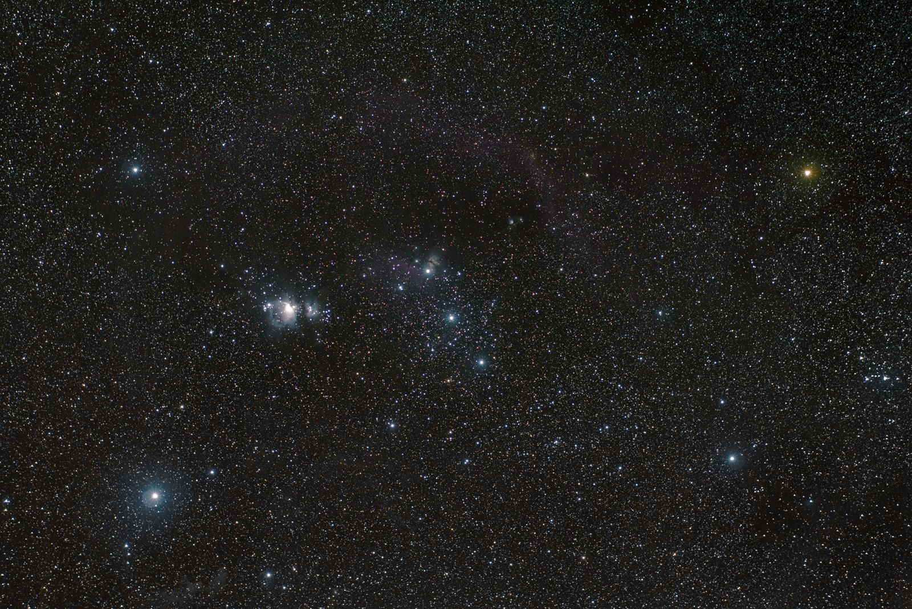
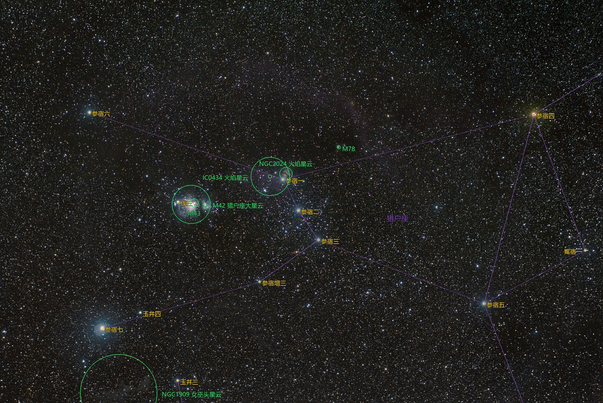
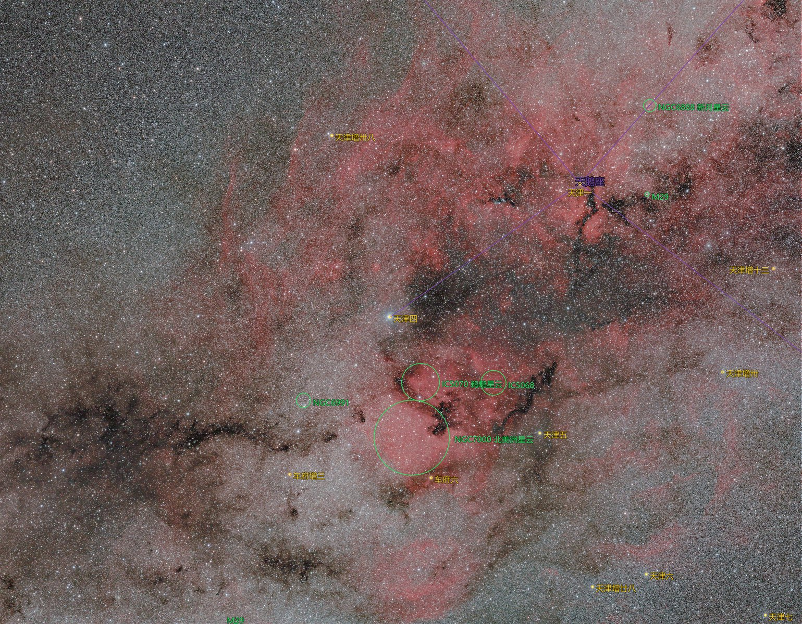
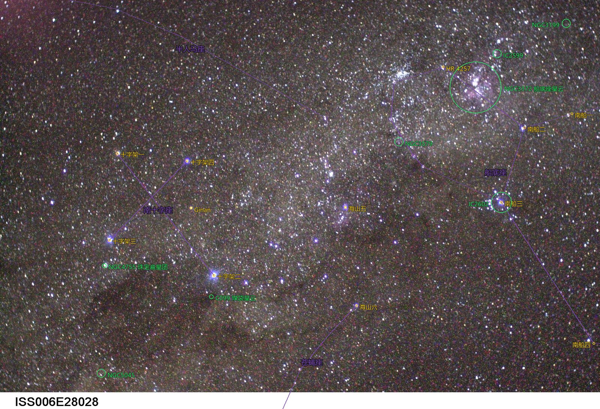

  

<h1 align="center">Starfield Atlas · 星图寻迹</h1>

Local-first astrometric plate solving, deep-sky identification, annotation, and a true first-person celestial-sphere viewer for real astrophotography.

[English](#english) · [简体中文](#简体中文) · [日本語](#日本語)

  

<table>
  <tr>
    <td width="50%">
      
       Drop, paste, or select a real sky photograph.
    </td>
    <td width="50%">
      
       Independent colours, font weights, and high-contrast outlines.
    </td>
  </tr>
  <tr>
    <td colspan="2">
      
       The solved photo footprint placed inside a continuous first-person celestial sphere.
    </td>
  </tr>
</table>

<table>
  <tr>
    <td width="50%">
      
       Original real photograph · 真实原片 · 実写の元画像
    </td>
    <td width="50%">
      
       Offline solve and annotation · 离线解算与标注 · オフライン解析と注釈
    </td>
  </tr>
</table>

<table>
  <tr>
    <td width="33%">
      
       Orion: M42, M43, M78, IC 434, NGC 2024, and constellation geometry.
    </td>
    <td width="33%">
      
       Cygnus: M29, M39, North America, Pelican, and Crescent nebula regions.
    </td>
    <td width="33%">
      
       NASA ISS photograph: Southern Cross, Carina Nebula, Coalsack, and Jewel Box region.
    </td>
  </tr>
</table>

The public photographs, authors, original pages, licences, hashes, and measured results are documented in the [real-sky test record](tests/network-fixtures/SOURCES_AND_RESULTS.md) and [NASA/ESA source record](tests/network-fixtures/SOURCES.md).

---

## English

### Turn a real sky photograph into a navigable star chart

Starfield Atlas is a Windows desktop application that accepts a JPG, PNG, or TIFF photograph, blind-solves its celestial coordinates from star geometry, projects local astronomical catalogues back onto the original pixels, and exports both a full-resolution annotated image and a structured JSON inventory.

Photo recognition runs locally. Capture time, GPS, focal length, and other EXIF fields can improve context or be displayed when present, but they are not required for plate solving.

### Why Starfield Atlas

- **Local blind plate solving** — ESA <code>tetra3</code> and a pinned Hipparcos-derived pattern database identify the field from star geometry. The solver does not need an online astrometry service.
- **EXIF is optional** — orientation, focal length, 35 mm equivalent focal length, exposure, aperture, ISO, time, and GPS are read when available. Missing EXIF does not prevent a genuine blind solve and missing values are not invented.
- **Real camera projection** — the result maps image pixels to J2000 RA/Dec, estimates rotation and plate scale, and fits low-order radial distortion.
- **Deep-sky, bright-star, and constellation overlays** — OpenNGC objects, bright stars, constellation names, and constellation segments are projected onto the actual photograph.
- **Honest catalogue semantics** — the JSON inventory preserves catalogue objects whose coordinates or angular footprints intersect the solved field. The static image shows only targets expected to be useful at the selected threshold, preventing hundreds of labels from covering the photograph.
- **True first-person celestial sphere** — the observer is at the centre of the celestial sphere looking outward. Drag continuously through 360°, return to the starting direction, and inspect both celestial poles without an externally viewed globe or a Web Mercator declination cutoff.
- **Accurate photo footprint** — the sky viewer uses densely sampled WCS points along all four photo edges instead of drawing a focal-length estimate or an axis-aligned rectangle.
- **Real survey imagery** — switch between DSS2 optical, DESI Legacy Surveys DR10 optical, and 2MASS J/H/Ks near-infrared HiPS layers.
- **Offline NASA object guide** — selected familiar galaxies, nebulae, supernova remnants, and clusters include locally stored NASA observation images, facts, credits, and original-source links.
- **Custom annotation design** — deep-sky objects, bright stars, and constellations have independent high-contrast colour choices. Text supports weights <code>500</code>, <code>650</code>, and <code>800</code>, optional dark outlines, live preview, and identical styling in the downloaded image.
- **Real progress, cancellation, and retry** — progress comes from backend stages rather than a simulated timer. The interface reports elapsed time and uploaded bytes, allows cancellation, retains the original file for retry, detects a 15-second upload idle timeout, and automatically stops an analysis that exceeds the UI time limit.
- **High-resolution workflow** — image lifetime, preview generation, TIFF normalization, crop solving, and full-resolution annotation are designed to limit peak memory. Version 1.1.0 has been exercised with original 60-megapixel photographs.
- **Desktop-friendly input** — select a file, drop it anywhere from Windows Explorer, drop file-backed temporary images from applications such as WeChat, or paste an image with <code>Ctrl+V</code>. Virtual attachments that Windows does not expose as files receive an explicit paste/open-original fallback.
- **Portable Windows build** — extract the ZIP and run <code>星图寻迹.exe</code>; Python, Node.js, and development dependencies are not required on the target computer.
- **Privacy by design** — the recognition server binds only to a random loopback port and exits with the desktop window. Photographs and recognition results stay on the machine. Only missing survey tiles are requested when the user opens the celestial-sphere viewer; photo bytes are not sent with those tile requests.
- **Defensive tile cache** — the local proxy restricts survey IDs and HiPS paths, enforces file-size and pixel limits, validates image signatures and full decoding, rejects HTML/error payloads, and commits valid cache files atomically.

### Recognition pipeline

1. Validate the image and read available metadata.
2. Correct EXIF orientation and prepare a memory-bounded solving image.
3. Perform lost-in-space plate solving with the local <code>tetra3</code> pattern database.
4. Build the pixel ↔ J2000 sky projection and fit low-order distortion.
5. Query local deep-sky, bright-star, and constellation catalogues against the solved footprint.
6. Generate a fast preview and a full-resolution annotated export.
7. Return the plate solution, evidence, catalogue inventory, image metadata, and output files as structured JSON.

### Catalogue coverage

The bundled source catalogues are fixed and provenance-tracked:

| Data set | Bundled coverage | Runtime use |
|---|---:|---|
| OpenNGC v20260501 | 14,033 rows; 14,026 with projectable coordinates | Deep-sky catalogue intersections and labels |
| Hipparcos/tetra3 bright-star subset | 8,818 stars, magnitude −1.44 to 7.00 | Solving and bright-star annotation |
| HYG v4.1 enrichment | 6,033 HR identifiers and 319 proper names | Display names and identifiers |
| Stellarium Chinese skyculture | 2,253 verified Chinese star labels | Traditional Chinese star naming |
| Celestial Data / d3-celestial | 88 IAU constellations, 753 line segments | Constellation geometry |
| First-person sky display catalogue | 374 common deep-sky objects, 491 bright stars, 88 constellation names, 753 segments | Adaptive celestial-sphere labels |
| NASA offline guide | 39 mapped objects, 37 unique observation images | Local object detail cards |

Seven OpenNGC records without finite coordinates are retained for source completeness but cannot be projected. Entries classified upstream as nonexistent or duplicates are not drawn as physical targets.

### First-person sky and survey layers

The viewer uses a TAN/gnomonic perspective: the screen is a window looking outward from the centre of the celestial sphere, not a ball rendered from outside.

- **DSS2 colour optical** — all-sky HiPS, orders 0–9; default optical background.
- **DESI Legacy Surveys DR10 colour optical** — HiPS orders 0–11; current coverage is <code>67.339%</code> of the sky. Blank regions mean that the survey has no coverage there.
- **2MASS colour near-infrared** — J/H/Ks composite, all-sky HiPS, orders 0–9. Its colours are a scientific band composite, not natural human vision.

The application bundles low-order Legacy DR10 and 2MASS overview material and their HiPS properties. Higher-order tiles are fetched only for the current view and cached locally. DSS2's full high-resolution tile tree is not included in the portable package; required DSS2 tiles are loaded on demand. If DSS2 metadata is unavailable during a cold offline start, the viewer can fall back to the bundled 2MASS overview.

Labels adapt to field size, catalogue priority, magnitude, and available spacing. Identified objects inside the photo footprint keep independent markers so they are not lost among full-sky labels.

### NASA offline object guide

The NASA detail pack contains real observation imagery downloaded from official <code>nasa.gov</code> sources—never generative images or search-engine thumbnails. Each record stores the catalogue mapping, source URL, original credit, media identifier where available, dimensions, and SHA-256.

If no suitable NASA asset is available for an object, the interface falls back to a crop of the user's photograph rather than presenting a neighbouring target as that object. NASA is a source of imagery and scientific facts; it has not reviewed or endorsed this application.

See [NASA source and usage notes](backend/data/nasa-deep-sky/SOURCES.md).

### Download and run

#### Windows portable edition

1. Open the [latest release](https://github.com/faradayhezz/starfield-atlas/releases/latest).
2. Download <code>Starfield-Atlas-Windows-x64-v1.1.0.zip</code>.
3. Extract the complete ZIP.
4. Run <code>星图寻迹.exe</code>.

Requirements:

- Windows 10 or Windows 11, x64
- Microsoft Edge WebView2 Runtime

The application stores photographs, results, and the survey-tile cache under <code>%LOCALAPPDATA%\星图寻迹</code>. It does not write user data into the program directory.

#### Run from source

~~~powershell
git clone https://github.com/faradayhezz/starfield-atlas.git
cd starfield-atlas
.\setup.cmd
.\start.cmd
~~~

For development:

~~~powershell
.\scripts\setup.ps1
.\scripts\run.ps1
.\scripts\test.ps1
~~~

Build the portable Windows release:

~~~powershell
.\scripts\build_windows.ps1
~~~

The build creates the application directory, distributable ZIP, and SHA-256 checksum file under <code>release/</code>.

### Supported photographs

- Formats: JPG/JPEG, PNG, TIFF
- Pixel depth: 8-bit, 16-bit, and supported 32-bit Pillow modes
- Colour: RGB or grayscale
- Application upload limit: 200 MB per image
- Recommended resolution: at least 1920 × 1280
- EXIF focal length and capture time are helpful but optional

### Validation

The project contains **60 automated tests** covering the HTTP analysis lifecycle, real progress, cancellation, upload timeout, EXIF handling, catalogue projection, annotation styling, sky projection, tile validation, NASA media records, and memory-conscious pipeline control.

Real-image validation includes:

- Two original 16-bit ESA <code>tetra3</code> camera frames blind-solved against published reference coordinates.
- Orion, Cygnus, and Cassiopeia wide-field photographs from Wikimedia Commons.
- A NASA ISS Southern Cross/Carina photograph whose official description names objects independently of this solver.
- A difficult high-density Milky Way photograph retained as an expected reliability-gate failure: the application rejects the solve instead of returning fabricated coordinates.

Recorded timing depends on hardware and image content. On the documented test machine, successful public samples completed between approximately 1.5 and 17 seconds.

See [the validation summary](tests/network-fixtures/NETWORK_TEST_SUMMARY.md).

### What “objects in the field” means

Starfield Atlas does not claim to detect every physically real galaxy or nebula visible—or too faint to be visible—in an image.

An object is included in the structured inventory when an entry from the selected local catalogue has a coordinate or angular footprint intersecting the solved sky field. Its evidence is recorded as <code>catalog_position</code>. The separate <code>expectedVisible</code> estimate determines whether it is useful to place on the static annotation at the current threshold.

This distinction keeps the output complete with respect to the chosen catalogue while remaining honest about what the pixels prove.

### Known limits

- Heavy defocus, clouds, strong moonlight, severe denoising, large foregrounds, or long unresolved star trails can prevent a reliable solve.
- The bundled <code>tetra3</code> pattern database directly targets roughly <code>10°–30°</code> horizontal fields. Wider photographs use central crops automatically; fields narrower than roughly <code>10°</code> are not currently supported for blind solving.
- The camera model is intended for rectilinear wide-angle and telephoto images. True fisheye images, stitched panoramas, and extreme distortion need a fisheye or tiled WCS model.
- EXIF can be absent or altered and is never accepted as a substitute for geometric star matching.
- Catalogue coordinates predict where an object should fall; they do not guarantee that the exposure visibly recorded it.
- The application is an identification and visualization tool, not a replacement for calibrated scientific astrometry or photometry.

### Architecture

- **Frontend:** React, TypeScript, Vite, Aladin Lite
- **Desktop shell:** pywebview with Microsoft Edge WebView2
- **Backend:** Python local HTTP API
- **Image and numerical processing:** Pillow, NumPy, SciPy
- **Plate solver:** ESA <code>tetra3</code>
- **Packaging:** PyInstaller on Windows

### Data provenance and licensing

Every bundled catalogue and image collection keeps fixed-source provenance, attribution, version information, and integrity hashes where applicable:

- [Catalogue provenance and integrity](backend/catalog_notes.md)
- [Machine-readable catalogue manifest](backend/data/catalog_manifest.json)
- [NASA media source notes](backend/data/nasa-deep-sky/SOURCES.md)
- [2MASS source notes](backend/data/2mass-allsky/SOURCES.md)
- [Legacy Surveys source notes](backend/data/legacy-survey-dr11/SOURCES.md)
- [Real test-image provenance](tests/fixtures/SOURCES.md)
- [Third-party software, data, and image notices](THIRD_PARTY_NOTICES.md)

Important third-party terms include:

- Aladin Lite 3.8.1: GPL-3.0
- ESA <code>tetra3</code>: Apache-2.0
- OpenNGC: CC BY-SA 4.0
- HYG Database and Stellarium Chinese skyculture enrichment: CC BY-SA 4.0
- Celestial Data constellation geometry: BSD-3-Clause
- Legacy Surveys imagery/HiPS: attribution and licence terms recorded with the packaged source
- 2MASS colour HiPS: ODbL 1.0 with UMass/IPAC-Caltech/CDS attribution
- NASA imagery: individual credits and NASA Images and Media Usage Guidelines; no endorsement is implied
- Public test photographs: their individual CC0, CC BY, CC BY-SA, Apache-2.0, or NASA usage terms

**Project licence:** original Starfield Atlas application code is released under [GPL-3.0-only](LICENSE), matching the GPLv3 terms of the bundled Aladin Lite viewer. Astronomical catalogues, survey tiles, NASA media, public test photographs, and other third-party material retain their own terms as recorded above and are not relicensed by the project licence.

---

## 简体中文

### 把真实星空照片变成可以探索的星图

“星图寻迹”是一款本地优先的 Windows 星空照片识别应用。将 JPG、PNG 或 TIFF 照片拖入应用后，它会根据星点几何进行盲星图解算，把离线天体目录投影回原始照片，并导出全分辨率标注图和结构化 JSON 天体清单。

照片识别在本机完成。拍摄时间、GPS、焦距及其他 EXIF 信息存在时可用于展示或辅助判断，但没有这些信息也可以进行真正的盲解算。

### 项目优势

- **完全本地的盲星图解算**：使用 ESA <code>tetra3</code> 和固定版本的 Hipparcos 派生模式库，不依赖在线 Astrometry 服务。
- **EXIF 不是必需条件**：支持读取方向、焦距、35mm 等效焦距、曝光、光圈、ISO、拍摄时间和 GPS；缺失时不会伪造，也不会阻止星点几何解算。
- **真实相机投影**：建立照片像素与 J2000 赤经/赤纬之间的转换，求得视场、旋转角、像素比例尺，并拟合低阶径向畸变。
- **深空天体、亮星和星座联合标注**：将 OpenNGC、亮星名称、星座名称与星座连线投影到照片的真实位置。
- **诚实的目录语义**：JSON 会保留与解算视场相交的目录天体；静态标注图只绘制当前阈值下预计适合显示的目标，避免几百个标签遮住照片。
- **真正的第一人称内视天球**：观察者位于天球球心向外看。可连续左右拖动 360° 并回到原方向，也可查看南北天极，不是从外部观看的圆球，也不受 Web Mercator 赤纬截断影响。
- **真实照片视场轮廓**：沿照片四边密集采样 WCS 点，绘制实际天空足迹，而不是用焦距估算一个水平矩形。
- **多套真实巡天影像**：支持 DSS2 光学、DESI Legacy Surveys DR10 光学和 2MASS J/H/Ks 近红外 HiPS。
- **NASA 离线天体图文**：常见星系、星云、超新星遗迹和星团可显示本地 NASA 真实观测图、简介、完整署名及原始来源链接。
- **丰富的标注样式**：深空天体、亮星、星座可分别选择高对比颜色或自定义颜色；字体支持 <code>500 / 650 / 800</code> 三档字重，可启用暗色描边；预览和下载图使用同一套样式。
- **真实进度、取消和重试**：进度来自后端真实阶段，并显示耗时和上传字节数；可随时取消，原文件会保留以便重试；上传连续 15 秒没有新数据会明确超时，超过界面总时限会自动停止。
- **大图内存优化**：优化了 TIFF 归一化、裁切解算、预览生成、Pillow 图像生命周期和全分辨率标注流程；1.1.0 已使用 60MP 原始照片进行回归测试。
- **适合桌面的输入方式**：可以选择文件，从资源管理器拖到窗口任意位置，从微信等软件拖入能够作为文件提供的临时图片，或按 <code>Ctrl+V</code> 粘贴。Windows 无法提供为文件的虚拟附件会明确提示粘贴或打开原图。
- **Windows 便携版**：解压 ZIP 后直接运行 <code>星图寻迹.exe</code>，目标电脑不需要安装 Python、Node.js 或开发依赖。
- **隐私优先**：识别服务只监听随机本机回环端口，并随桌面窗口退出；照片与结果留在本机。只有打开天球并查看未缓存区域时才会请求巡天瓦片，请求不会携带用户照片。
- **安全的瓦片缓存**：本机代理限制合法巡天、HiPS 路径、文件大小和像素数，验证文件签名与完整解码，拒绝 HTML 错误页和截断图像，并以原子方式写入有效缓存。

### 识别流程

1. 检查图片并读取可用元数据。
2. 处理 EXIF Orientation，生成内存受控的解算图像。
3. 使用本地 <code>tetra3</code> 模式库进行 lost-in-space 盲解算。
4. 建立像素与 J2000 天球坐标之间的投影并拟合低阶畸变。
5. 查询视场内的深空天体、亮星和星座目录。
6. 生成快速预览与全分辨率标注图。
7. 输出星图解、证据信息、目录清单、照片信息和导出文件。

### 内置目录覆盖

| 数据集 | 内置规模 | 用途 |
|---|---:|---|
| OpenNGC v20260501 | 14,033 条，其中 14,026 条有可投影坐标 | 深空天体视场查询和标注 |
| Hipparcos/tetra3 亮星子集 | 8,818 颗，星等 −1.44 至 7.00 | 解算与亮星标注 |
| HYG v4.1 补充 | 6,033 个 HR 编号、319 个正式名称 | 名称和编号 |
| Stellarium 中国星官文化 | 2,253 个经来源核对的中文星名 | 中国传统星名 |
| Celestial Data / d3-celestial | 88 个 IAU 星座、753 条线段 | 星座几何 |
| 第一人称天球显示目录 | 374 个常规深空天体、491 颗亮星、88 个星座名、753 条线段 | 自适应天球标签 |
| NASA 离线资料 | 39 个映射天体、37 张唯一观测图 | 本地天体详情卡 |

OpenNGC 中 7 条没有有限坐标的记录为保持来源完整性而保留，但无法投影。上游标记为不存在或重复的条目不会被绘制成第二个物理天体。

### 第一人称天球与巡天图层

天球采用 TAN/Gnomonic 透视投影：屏幕是人站在天球中心向外观察的一扇窗口，而不是从外部观看一个球。

- **DSS2 全天彩色光学**：HiPS order 0–9，默认光学背景。
- **DESI Legacy Surveys DR10 彩色光学**：HiPS order 0–11，当前覆盖全天的 <code>67.339%</code>；空白区表示巡天没有覆盖。
- **2MASS J/H/Ks 近红外合成**：HiPS order 0–9，全天覆盖；颜色属于科学波段合成，不等同于肉眼自然色。

应用内置 Legacy DR10 和 2MASS 的低阶概览及 HiPS 属性。高清瓦片只按当前视区读取并缓存在本机。完整 DSS2 高清瓦片树不会随便携包一起分发；DSS2 初始化失败且处于冷启动离线状态时，可回退到内置 2MASS 全天概览。

标签会依据视场大小、目录优先级、星等和可用间距自适应增减。照片视场内已经识别的目标保留独立标记，不会在全天标签中消失。

### NASA 离线天体资料

NASA 详情包只使用从 <code>nasa.gov</code> 官方来源下载的真实观测图，不使用生成式图片，也不把搜索引擎缩略图当作原始素材。每条记录保存目录映射、原始页面、署名、媒体编号、图像尺寸和 SHA-256。

没有合适 NASA 素材的目标会回退到用户照片的局部裁切，不会拿相邻天区冒充。NASA 是图片和科学事实来源，没有审核或认可本应用。

详见 [NASA 资料来源与使用说明](backend/data/nasa-deep-sky/SOURCES.md)。

### 下载与运行

#### Windows 便携版

1. 打开[最新版本页面](https://github.com/faradayhezz/starfield-atlas/releases/latest)。
2. 下载 <code>Starfield-Atlas-Windows-x64-v1.1.0.zip</code>。
3. 完整解压 ZIP。
4. 双击 <code>星图寻迹.exe</code>。

系统要求：

- Windows 10 或 Windows 11 x64
- Microsoft Edge WebView2 Runtime

照片、结果和巡天瓦片缓存保存在 <code>%LOCALAPPDATA%\星图寻迹</code>，不会写入程序目录。

#### 从源码运行

~~~powershell
git clone https://github.com/faradayhezz/starfield-atlas.git
cd starfield-atlas
.\setup.cmd
.\start.cmd
~~~

开发、测试与打包：

~~~powershell
.\scripts\setup.ps1
.\scripts\run.ps1
.\scripts\test.ps1
.\scripts\build_windows.ps1
~~~

### 支持的照片

- JPG/JPEG、PNG、TIFF
- 8 位、16 位及 Pillow 支持的 32 位模式
- RGB 或灰度
- 单张文件上限 200 MB
- 建议分辨率不低于 1920 × 1280
- 焦距和拍摄时间有帮助，但不是必需项

### 真实测试

项目包含 **60 项自动化测试**，覆盖分析请求生命周期、真实进度、取消、上传超时、EXIF、目录投影、标注样式、天球投影、瓦片验证、NASA 资料和大图内存控制。

真实照片验证包括：

- 两张 ESA <code>tetra3</code> 16 位相机原片，与公开参考坐标对照。
- Wikimedia Commons 的猎户座、天鹅座和仙后座宽场照片。
- NASA ISS 南十字座/船底座照片；NASA 原始说明在运行本项目之前已经独立指出其中天体。
- 一张高密度银河和地景压力样片被保留为可靠性门限失败测试：应用拒绝不可靠解，而不是输出伪造坐标。

不同电脑和照片的耗时会不同。现有公开成功样片在记录测试机上约用时 1.5–17 秒。

详见 [真实样片验证汇总](tests/network-fixtures/NETWORK_TEST_SUMMARY.md)。

### “视场内天体”的准确含义

“星图寻迹”不会声称检测到了照片中每一个真实存在的遥远星系或星云。

当所选本地目录中的天体坐标或角尺寸与已解算视场相交时，它会进入结构化清单，证据类型记录为 <code>catalog_position</code>。独立的 <code>expectedVisible</code> 字段估计该目标是否适合在当前阈值下画到静态图上。

这表示输出对所选目录尽可能完整，同时不会把目录预测位置冒充成像素级视觉检测证据。

### 已知边界

- 严重失焦、云层、强月光、过度降噪、大面积地景或无法分离的长星轨可能导致解算失败。
- 当前模式库直接面向约 <code>10°–30°</code> 水平视场；更宽照片会自动尝试中央裁切，小于约 <code>10°</code> 的窄视场目前不支持盲解。
- 相机模型适合直线广角和中长焦；真正鱼眼、全景拼接和极强畸变需要专门的鱼眼或分块 WCS。
- EXIF 可能缺失或被修改，不能代替星点几何验证。
- 目录坐标只说明天体应该落在哪里，不保证本次曝光真正拍到了它。
- 本应用用于识别和可视化，不能替代经过标定的科学天体测量或测光软件。

### 技术架构

- 前端：React、TypeScript、Vite、Aladin Lite
- 桌面容器：pywebview + Microsoft Edge WebView2
- 后端：Python 本地 HTTP API
- 图像与数值计算：Pillow、NumPy、SciPy
- 星图解算：ESA <code>tetra3</code>
- Windows 打包：PyInstaller

### 数据来源与许可证

固定来源、版本、署名、第三方许可证或使用规范及完整性记录位于：

- [目录来源与完整性](backend/catalog_notes.md)
- [机器可读目录清单](backend/data/catalog_manifest.json)
- [NASA 素材说明](backend/data/nasa-deep-sky/SOURCES.md)
- [2MASS 来源说明](backend/data/2mass-allsky/SOURCES.md)
- [Legacy Surveys 来源说明](backend/data/legacy-survey-dr11/SOURCES.md)
- [真实测试照片来源](tests/fixtures/SOURCES.md)
- [第三方软件、数据与图片通知](THIRD_PARTY_NOTICES.md)

主要第三方条款包括：

- Aladin Lite 3.8.1：GPL-3.0
- ESA <code>tetra3</code>：Apache-2.0
- OpenNGC：CC BY-SA 4.0
- HYG 与 Stellarium 中国星官资料：CC BY-SA 4.0
- Celestial Data 星座几何：BSD-3-Clause
- Legacy Surveys：按随数据保存的署名与许可条款使用
- 2MASS 彩色 HiPS：ODbL 1.0，并保留 UMass、IPAC-Caltech 与 CDS 署名
- NASA 图片：保留逐图署名并遵守 NASA Images and Media Usage Guidelines，不暗示 NASA 认可
- 公开测试照片：分别遵守 CC0、CC BY、CC BY-SA、Apache-2.0 或 NASA 使用说明

**项目许可证：**“星图寻迹”的原创应用代码以 [GPL-3.0-only](LICENSE) 发布，与内置 Aladin Lite 的 GPLv3 条款保持兼容。天文目录、巡天瓦片、NASA 素材、公开测试照片及其他第三方内容继续适用各自条款，不会被项目代码许可证重新授权。

---

## 日本語

### 実際の星空写真を、探索できる星図へ

Starfield Atlas（星图寻迹）は、ローカル処理を基本とする Windows 用の星空写真認識アプリです。JPG、PNG、TIFF 画像を読み込み、星の幾何配置から天球座標をブラインドでプレートソルブし、ローカル天体カタログを元画像の正しい画素位置へ投影します。全解像度の注釈画像と構造化 JSON 一覧を出力できます。

撮影時刻、GPS、焦点距離などの EXIF 情報は、存在する場合に表示や補助情報として利用します。これらがなくても、星の配置によるブラインドソルブは可能です。

### 主な特長

- **ローカルのブラインド・プレートソルビング**：ESA <code>tetra3</code> と固定版の Hipparcos 由来パターンデータベースを使用し、オンラインの Astrometry サービスを必要としません。
- **EXIF は必須ではありません**：Orientation、焦点距離、35mm 換算焦点距離、露出、絞り、ISO、撮影時刻、GPS を利用可能な場合だけ読み取り、欠落値を作りません。
- **実際のカメラ投影**：画像画素と J2000 赤経・赤緯の変換、画角、回転角、ピクセルスケール、および低次の放射歪みを求めます。
- **深宇宙天体・明るい恒星・星座を同時表示**：OpenNGC、恒星名、星座名、星座線を実際の写真上へ投影します。
- **誤解を招かないカタログ表現**：JSON には解決済み視野と交差するカタログ天体を保存し、静止画には現在のしきい値で有用と推定された対象だけを描画します。
- **天球中心から見る一人称ビュー**：観察者が天球の中心にいて外向きに見る方式です。左右へ連続して 360° 回転し、元の方向へ戻れます。南北天極も表示でき、外側から見る球体や Web Mercator の赤緯制限ではありません。
- **正確な写真視野形状**：写真の四辺を WCS で高密度サンプリングし、単純な焦点距離推定や軸平行矩形ではなく実際の視野輪郭を描きます。
- **実在する全天サーベイ画像**：DSS2 光学、DESI Legacy Surveys DR10 光学、2MASS J/H/Ks 近赤外 HiPS を切り替えられます。
- **NASA オフライン天体ガイド**：代表的な銀河、星雲、超新星残骸、星団について、NASA の実観測画像、解説、クレジット、原典リンクをローカルで表示します。
- **注釈デザインを細かく設定**：深宇宙天体、恒星、星座ごとに高コントラスト色または任意色を選択でき、文字ウェイト <code>500 / 650 / 800</code> と暗色アウトラインに対応します。
- **実進捗・キャンセル・再試行**：疑似タイマーではなくバックエンドの実処理段階を表示します。経過時間と受信バイト数を確認でき、キャンセル後も元画像を保持して再試行できます。アップロードが 15 秒間停止した場合は明確にタイムアウトします。
- **高解像度画像向けのメモリ最適化**：TIFF 正規化、解決用クロップ、プレビュー生成、Pillow 画像寿命、全解像度注釈処理を最適化し、60MP の原画像で回帰確認しています。
- **デスクトップ向け入力**：ファイル選択、Windows Explorer からウィンドウ全体へのドロップ、WeChat などが通常ファイルとして提供する一時画像のドロップ、<code>Ctrl+V</code> 貼り付けに対応します。
- **Windows ポータブル版**：ZIP を展開して <code>星图寻迹.exe</code> を実行するだけで、対象 PC に Python や Node.js は不要です。
- **プライバシー優先**：認識サーバーはランダムなローカル・ループバックポートだけを使用し、ウィンドウ終了時に停止します。写真と認識結果はローカルに残ります。
- **防御的な HiPS キャッシュ**：サーベイ ID、パス、ファイルサイズ、画素数、画像署名、完全デコードを検証し、HTML エラーページや破損画像をキャッシュへ保存しません。

### 認識処理

1. 画像を検証し、利用可能なメタデータを読み取ります。
2. EXIF Orientation を補正し、メモリ使用量を抑えた解決用画像を準備します。
3. ローカル <code>tetra3</code> パターンデータベースで lost-in-space ソルブを実行します。
4. 画素と J2000 天球座標の投影、および低次歪みを推定します。
5. 解決済み視野に対して深宇宙天体、恒星、星座カタログを検索します。
6. 高速プレビューと全解像度注釈画像を生成します。
7. プレート解、根拠、カタログ一覧、画像情報、出力ファイルを JSON で返します。

### 内蔵カタログ

| データセット | 収録規模 | 用途 |
|---|---:|---|
| OpenNGC v20260501 | 14,033 件、うち 14,026 件は投影可能 | 深宇宙天体の視野検索と注釈 |
| Hipparcos/tetra3 明るい恒星サブセット | 8,818 星、等級 −1.44〜7.00 | ソルブと恒星注釈 |
| HYG v4.1 補足 | 6,033 HR 番号、319 固有名 | 表示名と識別子 |
| Stellarium 中国星文化 | 検証済み中国語恒星名 2,253 件 | 中国伝統星名 |
| Celestial Data / d3-celestial | IAU 88 星座、753 線分 | 星座形状 |
| 一人称天球表示カタログ | 代表的深宇宙天体 374、明るい恒星 491、星座名 88、線分 753 | 適応的な天球ラベル |
| NASA オフラインガイド | 対応天体 39、固有観測画像 37 | ローカル詳細カード |

有限座標を持たない OpenNGC の 7 レコードは出典完全性のため保持されていますが、投影できません。上流で不存在または重複と分類された項目は、別の物理天体として描画しません。

### 一人称天球とサーベイ

ビューアは TAN/Gnomonic 透視投影を使用します。画面は天球中心から外を見る窓であり、外側から描画された球体ではありません。

- **DSS2 全天カラー光学**：HiPS order 0–9、既定の光学背景。
- **DESI Legacy Surveys DR10 カラー光学**：HiPS order 0–11、現在の全天被覆率は <code>67.339%</code>。空白はサーベイ未観測域です。
- **2MASS J/H/Ks カラー近赤外**：HiPS order 0–9、全天を被覆。色は科学バンド合成であり、肉眼の自然色ではありません。

Legacy DR10 と 2MASS の低次全天概要および HiPS プロパティを同梱します。高次タイルは現在の表示範囲だけを取得し、ローカルにキャッシュします。DSS2 の完全な高解像度タイル群はポータブル版には含まれず、必要な範囲だけオンデマンドで取得します。

ラベル数は視野、カタログ優先度、等級、利用可能な間隔に応じて調整されます。写真視野内で識別された対象には独立マーカーを残します。

### NASA オフライン資料

NASA 詳細パックは <code>nasa.gov</code> の公式ソースから取得した実観測画像だけを使用し、生成画像や検索エンジンのサムネイルは使用しません。各レコードにカタログ対応、原典 URL、クレジット、NASA ID、寸法、SHA-256 を保存しています。

適切な NASA 素材がない場合はユーザー写真のクロップを使用し、近隣天体の画像を対象天体として偽装しません。NASA は画像と科学情報の出典であり、本アプリを審査または推奨していません。

### ダウンロードと実行

#### Windows ポータブル版

1. [最新リリース](https://github.com/faradayhezz/starfield-atlas/releases/latest)を開きます。
2. <code>Starfield-Atlas-Windows-x64-v1.1.0.zip</code> をダウンロードします。
3. ZIP 全体を展開します。
4. <code>星图寻迹.exe</code> を実行します。

必要環境：

- Windows 10 または Windows 11 x64
- Microsoft Edge WebView2 Runtime

写真、結果、サーベイタイルのキャッシュは <code>%LOCALAPPDATA%\星图寻迹</code> に保存されます。

#### ソースから実行

~~~powershell
git clone https://github.com/faradayhezz/starfield-atlas.git
cd starfield-atlas
.\setup.cmd
.\start.cmd
~~~

開発、テスト、Windows ビルド：

~~~powershell
.\scripts\setup.ps1
.\scripts\run.ps1
.\scripts\test.ps1
.\scripts\build_windows.ps1
~~~

### 対応画像

- JPG/JPEG、PNG、TIFF
- 8-bit、16-bit、および Pillow が対応する 32-bit モード
- RGB またはグレースケール
- 1 ファイル最大 200 MB
- 推奨解像度 1920 × 1280 以上
- 焦点距離と撮影時刻は有用ですが必須ではありません

### 検証

プロジェクトには **60 件の自動テスト**があり、HTTP 分析処理、実進捗、キャンセル、アップロード・タイムアウト、EXIF、カタログ投影、注釈スタイル、天球投影、タイル検証、NASA 資料、メモリ制御を確認します。

実画像による検証には、ESA <code>tetra3</code> の 16-bit 原画像、Wikimedia の Orion・Cygnus・Cassiopeia、NASA ISS の Southern Cross/Carina 写真が含まれます。高密度の天の川と地上風景を含む難しい画像は、誤った座標を返さず信頼性ゲートで失敗する回帰ケースとして保持しています。

成功した公開サンプルの記録時間は、テスト機上で約 1.5〜17 秒です。詳細は [検証サマリー](tests/network-fixtures/NETWORK_TEST_SUMMARY.md) を参照してください。

### 「視野内天体」の意味

本アプリは、画像内に物理的に存在するすべての銀河・星雲を画素から検出したとは主張しません。

ローカルカタログの座標または角サイズが解決済み視野と交差した場合、その天体を構造化一覧へ含め、根拠を <code>catalog_position</code> として記録します。<code>expectedVisible</code> は、現在のしきい値で静止画へ表示する価値があるかを別途推定します。

### 既知の制限

- 強いピンぼけ、雲、月光、過度なノイズ除去、大きな前景、長い星跡では解決できない場合があります。
- 現在のパターンデータベースは主に水平画角約 <code>10°〜30°</code> 向けです。より広い画像は中央クロップを試し、約 <code>10°</code> 未満の狭視野ブラインドソルブには未対応です。
- 真の魚眼、パノラマ合成、極端な歪みには専用の魚眼または分割 WCS が必要です。
- EXIF は欠落・改変され得るため、星の幾何一致の代わりにはなりません。
- カタログ位置は天体の予測位置であり、露出に実際に写っていることを保証しません。
- 本アプリは識別・可視化ツールであり、校正済みの科学アストロメトリや測光ソフトの代替ではありません。

### 技術構成

- フロントエンド：React、TypeScript、Vite、Aladin Lite
- デスクトップ：pywebview + Microsoft Edge WebView2
- バックエンド：Python ローカル HTTP API
- 画像・数値処理：Pillow、NumPy、SciPy
- プレートソルバー：ESA <code>tetra3</code>
- Windows パッケージ：PyInstaller

### データ出典とライセンス

出典、固定バージョン、クレジット、第三者ライセンス、ハッシュは以下に記録されています。

- [カタログ出典と完全性](backend/catalog_notes.md)
- [機械可読カタログ・マニフェスト](backend/data/catalog_manifest.json)
- [NASA 素材の出典](backend/data/nasa-deep-sky/SOURCES.md)
- [2MASS 出典](backend/data/2mass-allsky/SOURCES.md)
- [Legacy Surveys 出典](backend/data/legacy-survey-dr11/SOURCES.md)
- [実画像テストの出典](tests/fixtures/SOURCES.md)
- [第三者ソフトウェア・データ・画像の通知](THIRD_PARTY_NOTICES.md)

主な第三者条件：

- Aladin Lite 3.8.1：GPL-3.0
- ESA <code>tetra3</code>：Apache-2.0
- OpenNGC：CC BY-SA 4.0
- HYG および Stellarium 中国星文化：CC BY-SA 4.0
- Celestial Data 星座形状：BSD-3-Clause
- Legacy Surveys：同梱出典に記録された表示・ライセンス条件
- 2MASS colour HiPS：ODbL 1.0、UMass / IPAC-Caltech / CDS のクレジット
- NASA 画像：個別クレジットと NASA Images and Media Usage Guidelines。NASA の推奨を意味しません
- 公開テスト画像：各画像の CC0、CC BY、CC BY-SA、Apache-2.0、または NASA 使用条件

**プロジェクト・ライセンス：** Starfield Atlas 独自のアプリケーションコードは、同梱する Aladin Lite の GPLv3 条件と互換になるよう [GPL-3.0-only](LICENSE) で公開します。天体カタログ、サーベイタイル、NASA 素材、公開テスト写真、その他の第三者コンテンツには各自の条件が継続して適用され、プロジェクトのコードライセンスによって再ライセンスされません。
