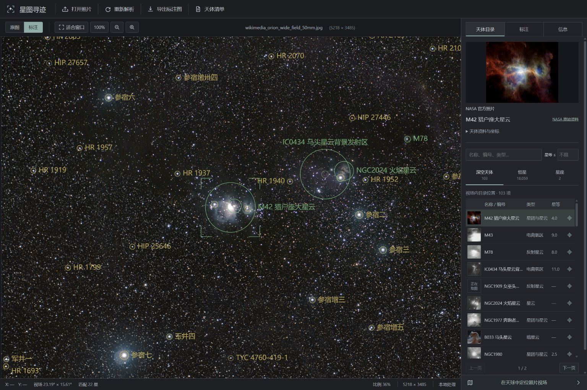
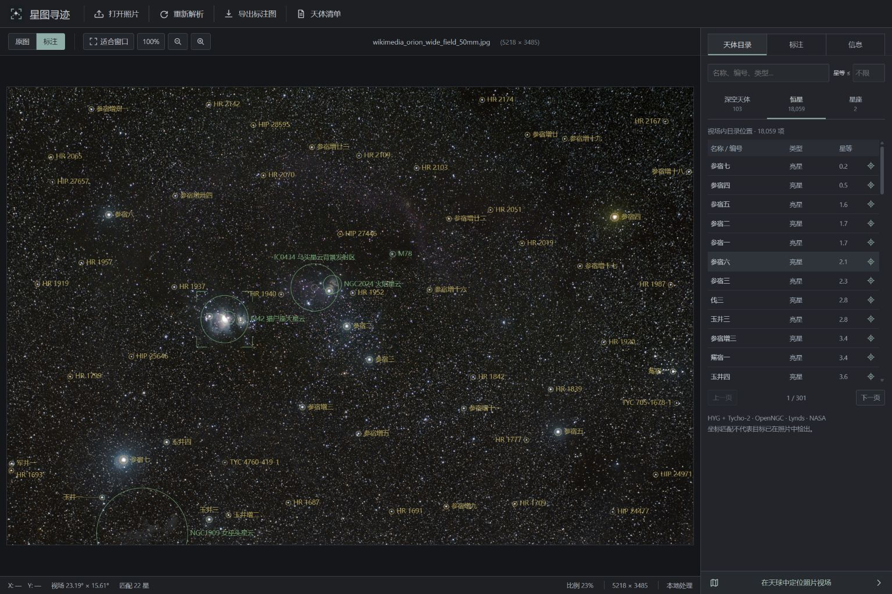

  

<h1 align="center">Starfield Atlas · 星图寻迹</h1>

Local-first plate solving, faint-star and deep-sky catalogues, native-resolution annotation, and a first-person celestial-sphere viewer for real astrophotography.

[English](#english) · [简体中文](#简体中文) · [日本語](#日本語)

[v1.3.0](docs/RELEASE_NOTES_1.3.0.md): 2.55 million stars, thinner unobstructed markers, and NASA images beside the catalogue. 255 万颗恒星、细线净空标注、目录旁直接查看 NASA 图片。255 万星、重なりを抑えた細いマーカー、一覧から見られる NASA 画像。

  

<table>
  <tr>
    <td width="50%">
      
       18,059 in-field stars in Orion · 18,059 颗视场恒星 · 視野内 18,059 星
    </td>
    <td width="50%">
      
       NASA imagery beside the catalogue · 目录旁的 NASA 图文 · 一覧と NASA 画像
    </td>
  </tr>
  <tr>
    <td colspan="2">
      
       The solved photo footprint placed inside a continuous first-person celestial sphere.
    </td>
  </tr>
</table>

<table>
  <tr>
    <td width="50%">
      
       Original real photograph · 真实原片 · 実写の元画像
    </td>
    <td width="50%">
      
       Offline solve and annotation · 离线解算与标注 · オフライン解析と注釈
    </td>
  </tr>
</table>

<table>
  <tr>
    <td width="33%">
      
       Orion: M42, M43, M78, IC 434, NGC 2024, and constellation geometry.
    </td>
    <td width="33%">
      
       Cygnus: M29, M39, North America, Pelican, and Crescent nebula regions.
    </td>
    <td width="33%">
      
       NASA ISS photograph: Southern Cross, Carina Nebula, Coalsack, and Jewel Box region.
    </td>
  </tr>
</table>

The top workbench screenshots show v1.3.0 and real sky photographs. The sky-view and three-field annotation gallery preserve earlier public-test results as historical examples. Public-image authors, licences and original pages are documented in the [source record](tests/network-fixtures/SOURCES_AND_RESULTS.md) and [NASA/ESA source record](tests/network-fixtures/SOURCES.md). See the [v1.3.0 catalogue and real-photo measurements](docs/STELLAR_CATALOG_1.3.0.md), [v1.2.0 validation](docs/VALIDATION_1.2.0.md), and [v1.2.1 import fixes](docs/RELEASE_NOTES_1.2.1.md).

---

## English

### Turn a real sky photograph into a navigable star chart

Starfield Atlas is a Windows desktop application that accepts JPG, PNG, TIFF and supported camera RAW files, blind-solves their celestial coordinates from star geometry, projects local astronomical catalogues back onto the original pixels, and exports a full-resolution annotated image and structured JSON inventory.

Photo recognition runs locally. Capture time, GPS, focal length, and other EXIF fields can improve context or be displayed when present, but they are not required for plate solving.

### Why Starfield Atlas

- **Local blind plate solving** — ESA <code>tetra3</code> and a pinned Hipparcos-derived pattern database identify the field from star geometry. The solver does not need an online astrometry service.
- **EXIF is optional** — orientation, focal length, 35 mm equivalent focal length, exposure, aperture, ISO, time, and GPS are read when available. Missing EXIF does not prevent a genuine blind solve and missing values are not invented.
- **Wide phone photographs without EXIF** — multiscale central probes support the verified roughly 70° phone case even after messaging removes camera metadata. A new 32% probe establishes the blind solution, then independent full-field stars validate rotation, focal scale and distortion. The real 4032 × 3024 phone JPEG retained its pixels and format; no camera model or reference coordinates were inserted. See [phone verification](docs/PHONE_WIDE_FIELD_1.3.0.md).
- **Real camera projection** — the result maps image pixels to J2000 RA/Dec, estimates rotation and plate scale, and fits low-order radial distortion.
- **2,552,824 real stars** — 119,625 HYG v4.1 stars plus 2,433,199 additional AT-HYG v3.2 / Tycho-2 stars. The 432 spatially indexed offline cells add only 49.8 MB; only relevant cells are opened. The default magnitude limit is 12, with each record's V or VT band retained. HIP/HD/HYG/TYC identifiers and all 2,253 traditional Chinese labels remain searchable, with no small inventory cap.
- **Faint galaxies and real dark clouds** — OpenNGC is joined by all 1,791 updated Lynds dark-nebula records. Combined runtime coverage is 15,162 projectable catalogue entries. Dark-cloud area and opacity retain their actual units; unknown magnitude stays unknown.
- **Honest catalogue semantics** — a projected position has <code>evidence: catalog_position</code> and <code>pixelDetected: false</code>. The full inventory and the initial display are separate: a faint catalogue entry can be inspected without claiming it was measured in the pixels.
- **A compact photo-analysis workbench** — image-first layout, compact toolbars, a searchable and paginated catalogue table, magnitude filtering, coordinate details, and direct object selection. Use fit-to-window or a 100% scale of the displayed image (reduced RAW/TIFF previews are labelled; exports remain full resolution), pan and zoom, and switch original/annotation without leaving the workspace.
- **True first-person celestial sphere** — the observer is at the centre of the celestial sphere looking outward. Drag continuously through 360°, return to the starting direction, and inspect both celestial poles without an externally viewed globe or a Web Mercator declination cutoff.
- **Accurate photo footprint** — the sky viewer uses densely sampled WCS points along all four photo edges instead of drawing a focal-length estimate or an axis-aligned rectangle.
- **Real survey imagery** — switch between DSS2 optical, DESI Legacy Surveys DR10 optical, and 2MASS J/H/Ks near-infrared HiPS layers.
- **NASA images directly in the workbench** — a visible image column and a selected-object detail above the table show real imagery, description, credits and source links. The offline pack includes 39 objects mapped to official NASA observation media and 68 coordinate-centred NASA SkyView DSS2 survey cutouts. Other eligible targets can request and cache a survey cutout on demand, with at most three requests in parallel.
- **Thin markers that keep the photograph visible** — moderate green <code>#69BE7A</code>, yellow <code>#D4B953</code> and purple <code>#A391BF</code>, 85% opacity, 18 px normal-weight text and 1.25 px base lines per 1920 px image width. Compact faint deep-sky objects and stars of magnitude 7 or fainter use 0.6× line width by default. Circles have transparent interiors and no marker halo, including high-contrast mode; labels avoid complete marker disks and crowded labels can use thin leaders. Stellar cores remain clear.
- **Independent stellar and deep-sky label density** — stars use budgets of 20 / 60 / 180, default 60; deep-sky labels use 35 / 90 / 180, default 35, before collision handling. These display budgets do not truncate the searchable inventory. Constellation lines start off. Choose hollow circles or corner brackets, layer colours, font size and weights <code>500 / 650 / 800</code>, opacity, line width and faint-marker scaling. Optional high contrast affects text rather than covering the space around circles. Preview and native export share the settings.
- **Camera RAW input** — rawpy/LibRaw decodes supported ARW, CR2/CR3, NEF, DNG, RAF, ORF, RW2 and other camera formats. Full-resolution demosaicing preserves the active image dimensions and applies orientation once. Annotated RAW exports as 16-bit TIFF; the original RAW is retained unchanged.
- **Native-resolution export** — JPG/JPEG, PNG and supported single-frame TIFF preserve their container, oriented pixel dimensions and supported bit depth. Changing annotation styles reuses the solved coordinates and composites over the retained source on the local backend; it does not rerun solving or encode a reduced browser canvas.
- **Real progress, cancellation, and retry** — progress comes from backend stages rather than a simulated timer. The interface reports elapsed time and uploaded bytes, allows cancellation, retains the original file for retry, detects a 15-second upload idle timeout, and automatically stops an analysis that exceeds the UI time limit.
- **High-resolution workflow** — bounded-strip conversion and compositing, prompt image-buffer release, one native full-frame operation at a time, and a bounded stellar-cell cache control memory growth. The 1.3.0 wide-field test retained 160,076 stars and original 9504 × 6336 JPEG pixels. Such large images and complete inventories can still need substantial memory; measured peak working sets and timings are published in the [catalogue validation](docs/STELLAR_CATALOG_1.3.0.md).
- **Desktop-friendly input** — select a file, drop it anywhere from Windows Explorer, drop file-backed temporary images from applications such as WeChat, or paste an image with <code>Ctrl+V</code>. Virtual attachments that Windows does not expose as files receive an explicit paste/open-original fallback.
- **Portable Windows build** — extract the ZIP and run <code>星图寻迹.exe</code>; Python, Node.js, and development dependencies are not required on the target computer.
- **Local photo processing** — the recognition server binds only to a random loopback port and exits with the desktop window. Photographs and recognition results stay on the machine. Uncached sky tiles and missing NASA SkyView illustrations require network requests; SkyView requests contain the selected target's public catalogue coordinates and field size, never the user's image bytes.
- **Defensive tile cache** — the local proxy restricts survey IDs and HiPS paths, enforces file-size and pixel limits, validates image signatures and full decoding, rejects HTML/error payloads, and commits valid cache files atomically.

### Recognition pipeline

1. Validate the image and read available metadata.
2. Correct EXIF orientation and prepare a memory-bounded solving image.
3. Perform lost-in-space plate solving with the local <code>tetra3</code> pattern database.
4. Build the pixel ↔ J2000 sky projection and fit low-order distortion.
5. Query the relevant offline stellar spatial cells and deep-sky/constellation catalogues against the solved footprint.
6. Generate a fast preview and a full-resolution annotated export.
7. Return the plate solution, evidence, catalogue inventory, image metadata, and output files as structured JSON.

### Catalogue coverage

The bundled source catalogues are fixed and provenance-tracked:

| Data set | Bundled coverage | Runtime use |
|---|---:|---|
| OpenNGC v20260501 | 14,033 rows; 14,026 with projectable coordinates | Deep-sky catalogue intersections and labels |
| Hipparcos/tetra3 bright-star subset | 8,818 stars, magnitude −1.44 to 7.00 | Local pattern-solving reference |
| HYG v4.1 full stellar inventory | 119,625 stars; 104,027 fainter than V=7 | In-frame faint-star inventory and selectable labels |
| AT-HYG v3.2 / Tycho-2 extension | 2,433,199 additional stars; combined stellar total 2,552,824 | Offline spatially indexed TYC stars with explicit VT magnitudes |
| Lynds dark-nebula catalogue, CDS VII/7A | 1,791 dark-cloud entries | Dark-cloud centres, areas and opacity classes |
| Stellarium Chinese skyculture | 2,253 verified Chinese star labels | Traditional Chinese star naming |
| Celestial Data / d3-celestial | 88 IAU constellations, 753 line segments | Constellation geometry |
| First-person sky display catalogue | 15,162 catalogue entries; 8,920 stellar context positions through V=6.5 | Adaptive, zoom-dependent sky labels |
| NASA official observation guide | 39 mapped objects, 37 unique observation images | Source-linked images and object descriptions |
| NASA SkyView / DSS2 offline cutouts | 68 catalogue-centred survey images | Survey illustrations, explicitly distinct from official object portraits |

Seven OpenNGC records without finite coordinates are retained for source completeness but cannot be projected. Nonexistent and duplicate entries are filtered at runtime. The combined 15,162-entry inventory includes 790 historical NGC/IC entries classified as stars or double stars; it is not a count of 15,162 distinct galaxies and nebulae. The stellar extension excludes only the Sun and explicit source HYG duplicates, preserving distinct Tycho components. Tycho-2 is approximately 90% complete at V≈11.5; its extension's faintest VT=15.193 and HYG's sparse V=21 tail do not imply completeness or image-detection limits. V and VT are different photometric bands. See [coverage and provenance](docs/STELLAR_CATALOG_1.3.0.md).

The **Deep-sky catalogue** selector filters the returned DSO inventory; it does
not change the independent stellar magnitude limit (12 by default, in the record's V/VT band) or the
annotation-density control.

| Deep-sky catalogue setting | Returned in-field records |
|---|---|
| Common targets (`bright`) | Known catalogue magnitude ≤10, or a named/Messier target recommended for display |
| Extended catalogue (`balanced`) | Known catalogue magnitude ≤15, or a named/Messier target recommended for display |
| Complete catalogue (`deep`, default) | All in-field records, including unnamed LDN clouds and unknown magnitudes |

Catalogue magnitudes can be recorded in different bands; the table retains the
band when supplied, and these cutoffs are selection rules, not detection limits.

### First-person sky and survey layers

The viewer uses a TAN/gnomonic perspective: the screen is a window looking outward from the centre of the celestial sphere, not a ball rendered from outside.

- **DSS2 colour optical** — all-sky HiPS, orders 0–9; default optical background.
- **DESI Legacy Surveys DR10 colour optical** — HiPS orders 0–11; current coverage is <code>67.339%</code> of the sky. Blank regions mean that the survey has no coverage there.
- **2MASS colour near-infrared** — J/H/Ks composite, all-sky HiPS, orders 0–9. Its colours are a scientific band composite, not natural human vision.

The application bundles low-order Legacy DR10 and 2MASS overview material and their HiPS properties. Higher-order tiles are fetched only for the current view and cached locally. DSS2's full high-resolution tile tree is not included in the portable package; required DSS2 tiles are loaded on demand. If DSS2 metadata is unavailable during a cold offline start, the viewer can fall back to the bundled 2MASS overview.

Labels adapt to field size, catalogue priority, magnitude, and available spacing. Identified objects inside the photo footprint keep independent markers so they are not lost among full-sky labels.

### NASA observation media and SkyView survey illustrations

The official NASA pack maps 39 objects to 37 real observation images downloaded from <code>nasa.gov</code>, with descriptions and source credits. A separate set of 68 offline **NASA SkyView DSS2 survey cutouts** is centred on exact catalogue coordinates. Survey cutouts show the surrounding sky and are labelled as survey imagery; they are not presented as dedicated Hubble/Webb portraits. Both sets retain original sources, credits and integrity metadata.

The table's image column and detail panel above the table make these illustrations visible while browsing. For other eligible targets, missing cutouts are loaded on demand from [NASA SkyView](https://skyview.gsfc.nasa.gov/), with a three-request concurrency limit and local caching. This does not promise a dedicated image or offline coverage for every NGC/IC record. If no external image is available, the user's own photo crop remains the fallback. DSS2 credits belong to STScI and the contributing Palomar/AAO surveys, with NASA SkyView as the delivery service; the interface preserves provider and original-source links. NASA has not endorsed this application.

See [official NASA media sources](backend/data/nasa-deep-sky/SOURCES.md) and [SkyView/DSS2 survey sources](backend/data/nasa-survey-cutouts/SOURCES.md).

### Download and run

#### Windows portable edition

1. Open the [latest release](https://github.com/faradayhezz/starfield-atlas/releases/latest).
2. Download <code>Starfield-Atlas-Windows-x64-v1.3.0.zip</code>.
3. Extract the complete ZIP.
4. Run <code>星图寻迹.exe</code>.

Requirements:

- Windows 10 or Windows 11, x64
- Microsoft Edge WebView2 Runtime

The application stores photographs, results, and the survey-tile cache under <code>%LOCALAPPDATA%\星图寻迹</code>. It does not write user data into the program directory.

#### Run from source

~~~powershell
git clone https://github.com/faradayhezz/starfield-atlas.git
cd starfield-atlas
.\setup.cmd
.\start.cmd
~~~

For development:

~~~powershell
.\scripts\setup.ps1
.\scripts\run.ps1
.\scripts\test.ps1
~~~

Build the portable Windows release:

~~~powershell
.\scripts\build_windows.ps1
~~~

The build creates the application directory, distributable ZIP, and SHA-256 checksum file under <code>release/</code>.

### Supported photographs

- Formats: JPG/JPEG, PNG, single-frame TIFF, and camera RAW supported by the bundled LibRaw
- Pixel depth: JPEG 8-bit; PNG 8/16-bit; supported integer and floating-point TIFF samples, including 16/32-bit
- Colour: RGB or grayscale
- Application upload limit: 200 MB per image
- Recommended resolution: at least 1920 × 1280
- EXIF focal length and capture time are helpful but optional

RAW is developed to full active-image resolution, then annotated into 16-bit TIFF. Rendered text cannot be written back into an original sensor mosaic as an unchanged camera RAW. EXIF orientation is applied once; a rotated photo can therefore swap width and height. Coloured annotations convert grayscale to RGB at the retained bit depth. **Pixel dimensions are preserved; file byte size cannot stay identical after adding marks or changing compression.** See [RAW and native export details](docs/RAW_AND_EXPORT.md).

Workbench shortcuts: <code>Ctrl+O</code> open, <code>Ctrl+S</code> export, <code>0</code> fit, <code>1</code> 100%, <code>H</code> toggle annotations, <code>+</code>/<code>−</code> zoom, <code>Esc</code> cancel an active analysis.

### Validation

Automated regressions cover the HTTP lifecycle, real progress, cancellation, upload timeout, EXIF orientation, faint catalogue projection, native PNG/TIFF samples, annotation core protection, export consistency, sky projection, tile validation and NASA media records. The release validation record documents the current results.

Real-image validation includes:

- Two original 16-bit ESA <code>tetra3</code> camera frames blind-solved against published reference coordinates.
- Orion, Cygnus, and Cassiopeia wide-field photographs from Wikimedia Commons.
- A NASA ISS Southern Cross/Carina photograph whose official description names objects independently of this solver.
- A difficult high-density Milky Way photograph retained as an expected reliability-gate failure: the application rejects the solve instead of returning fabricated coordinates.
- The 1.3.0 9504 × 6336 wide-field and galaxy-group originals, returning 160,076 and 8,331 stellar positions respectively, plus 18,059 stars in the public Orion photograph. Their native JPEG dimensions are preserved; the 1.2.0 original-photo tests remain documented separately.
- A real 4032 × 3024 phone photograph with no EXIF and strong sky glow: 22 blind pattern matches, 106 full-field anchors, 26 held-out anchors, and 266,351 available catalogue stars. Full-field calibration covered about 85% of the width and 84% of the height, with 2.60 original-pixel RMS; this does not mean every projected catalogue star was detected.
- A real Nikon D3S NEF decoded to 4284 × 2844 uint16 RGB with camera metadata. This is a RAW decoder/export test, not a claim that the aurora photograph successfully plate-solved.

The four 1.3.0 source-pipeline measurements completed in approximately 2.5–12.6 seconds, including full-resolution JPEG export and complete JSON inventories; the phone case completed in 9.096 seconds. Large JSON responses support gzip transfer; catalogue pagination limits visible rows while retaining the complete inventory. Wide-field inventories still require memory, as documented by the 160,076-star and 266,351-star cases. Timing depends on the image and hardware; packaged/browser validation and historical Cassiopeia/NASA runs are separately documented.

See [v1.3.0 catalogue validation](docs/STELLAR_CATALOG_1.3.0.md), [wide-phone verification](docs/PHONE_WIDE_FIELD_1.3.0.md), [historical v1.2.0 validation](docs/VALIDATION_1.2.0.md), [RAW testing](docs/RAW_AND_EXPORT.md), and the [historical public-sky record](tests/network-fixtures/NETWORK_TEST_SUMMARY.md).

### What “objects in the field” means

Starfield Atlas does not claim to detect every physically real galaxy or nebula visible—or too faint to be visible—in an image.

An object is included when its catalogue position or angular footprint intersects the solved field and it passes the selected deep-sky catalogue depth or independent stellar magnitude limit. Its evidence is <code>catalog_position</code>, with <code>pixelDetected: false</code>. The renderer selects stellar labels from the eligible full inventory using the independent stellar density and collision rules; old <code>defaultVisible</code>/<code>recommendedLabel</code> flags no longer cap it to a handful of bright stars. Legacy <code>expectedVisible</code> remains a display recommendation, never a photometric detection measurement.

This distinction keeps the output complete with respect to the chosen catalogue while remaining honest about what the pixels prove.

### Known limits

- Heavy defocus, clouds, strong moonlight, severe denoising, large foregrounds, or long unresolved star trails can prevent a reliable solve.
- The bundled <code>tetra3</code> pattern database directly targets roughly <code>10°–30°</code> horizontal fields. Wider photographs use central crops automatically; fields narrower than roughly <code>10°</code> are not currently supported for blind solving.
- The camera model is intended for rectilinear wide-angle and telephoto images. True fisheye images, stitched panoramas, and extreme distortion need a fisheye or tiled WCS model.
- EXIF can be absent or altered and is never accepted as a substitute for geometric star matching.
- Catalogue coordinates predict where an object should fall; they do not guarantee that the exposure visibly recorded it.
- HYG and AT-HYG/Tycho positions retain J2000. Proper-motion metadata is included but is not propagated to an assumed observation date; high-proper-motion stars can be displaced in recent photographs.
- LDN cloud centres have arcminute-scale source precision. An area-equivalent circle is an approximate size guide, not a measured cloud boundary.
- Camera-model RAW support depends on LibRaw. Multi-frame TIFF, unsupported sample layouts, and unsupported RAW cameras are reported explicitly rather than silently flattened.
- The application is an identification and visualization tool, not a replacement for calibrated scientific astrometry or photometry.

### Architecture

- **Frontend:** React, TypeScript, Vite, Aladin Lite
- **Desktop shell:** pywebview with Microsoft Edge WebView2
- **Backend:** Python local HTTP API
- **Image and numerical processing:** Pillow, NumPy, SciPy, rawpy/LibRaw, tifffile, imagecodecs, ExifRead
- **Plate solver:** ESA <code>tetra3</code>
- **Packaging:** PyInstaller on Windows

### Data provenance and licensing

Every bundled catalogue and image collection keeps fixed-source provenance, attribution, version information, and integrity hashes where applicable:

- [Catalogue provenance and integrity](backend/catalog_notes.md)
- [Machine-readable catalogue manifest](backend/data/catalog_manifest.json)
- [NASA media source notes](backend/data/nasa-deep-sky/SOURCES.md)
- [2MASS source notes](backend/data/2mass-allsky/SOURCES.md)
- [Legacy Surveys source notes](backend/data/legacy-survey-dr11/SOURCES.md)
- [Real test-image provenance](tests/fixtures/SOURCES.md)
- [Third-party software, data, and image notices](THIRD_PARTY_NOTICES.md)

Important third-party terms include:

- Aladin Lite 3.8.1: GPL-3.0
- ESA <code>tetra3</code>: Apache-2.0
- OpenNGC: CC BY-SA 4.0
- HYG Database, AT-HYG/Tycho extension and Stellarium Chinese skyculture: CC BY-SA 4.0
- Lynds dark-nebula records: original scientific catalogue attribution and [source terms](backend/data/LICENSES/LYNDS-DARK-NEBULAE-NOTICE.md)
- RAW and native image codecs: component-specific notices, including the separate LibRaw library; see [RAW dependency sources](docs/RAW_AND_EXPORT.md)
- Celestial Data constellation geometry: BSD-3-Clause
- Legacy Surveys imagery/HiPS: attribution and licence terms recorded with the packaged source
- 2MASS colour HiPS: ODbL 1.0 with UMass/IPAC-Caltech/CDS attribution
- NASA imagery: individual credits and NASA Images and Media Usage Guidelines; no endorsement is implied
- Public test photographs: their individual CC0, CC BY, CC BY-SA, Apache-2.0, or NASA usage terms

**Project licence:** original Starfield Atlas application code is released under [GPL-3.0-only](LICENSE), matching the GPLv3 terms of the bundled Aladin Lite viewer. Astronomical catalogues, survey tiles, NASA media, public test photographs, and other third-party material retain their own terms as recorded above and are not relicensed by the project licence.

---

## 简体中文

### 把真实星空照片变成可以探索的星图

“星图寻迹”是一款本地优先的 Windows 星空照片识别应用。支持 JPG、PNG、TIFF 和受支持的相机 RAW，根据星点几何进行盲星图解算，把离线天体目录投影回原始照片，并导出全分辨率标注图和结构化 JSON 天体清单。

照片识别在本机完成。拍摄时间、GPS、焦距及其他 EXIF 信息存在时可用于展示或辅助判断，但没有这些信息也可以进行真正的盲解算。

### 项目优势

- **完全本地的盲星图解算**：使用 ESA <code>tetra3</code> 和固定版本的 Hipparcos 派生模式库，不依赖在线 Astrometry 服务。
- **EXIF 不是必需条件**：支持读取方向、焦距、35mm 等效焦距、曝光、光圈、ISO、拍摄时间和 GPS；缺失时不会伪造，也不会阻止星点几何解算。
- **无 EXIF 的广角手机照片**：多尺度中央搜索支持本次实测约 70° 的手机星空，即使聊天软件删除了相机信息也可解算。新增 32% 中央区域先进行盲匹配，再以独立的全画面星点校验旋转、焦距和畸变。真实 4032 × 3024 手机 JPEG 保留原像素和格式，不填入参考截图的坐标或相机型号。详见[手机宽场验证](docs/PHONE_WIDE_FIELD_1.3.0.md)。
- **真实相机投影**：建立照片像素与 J2000 赤经/赤纬之间的转换，求得视场、旋转角、像素比例尺，并拟合低阶径向畸变。
- **2,552,824 颗真实恒星**：保留 HYG v4.1 的 119,625 颗恒星，新增 AT-HYG v3.2 / Tycho-2 的 2,433,199 颗。432 个离线空间分片合计约 49.8 MB，只读取相关天区。默认星等上限为 12，每条记录明确区分 V 或 VT 波段；可搜索 HIP、HD、HYG、TYC 编号，保留全部 2,253 个传统中文星名，清单不受少量标签预算限制。
- **暗弱星系与真实暗星云**：OpenNGC 之外新增全部 1,791 条新版 Lynds 暗星云记录，运行时合计 15,162 条可投影目录记录。暗星云面积、不透明度保留真实单位，未知星等不编造。
- **诚实的目录语义**：投影结果明确记录 <code>evidence: catalog_position</code> 和 <code>pixelDetected: false</code>。完整清单和初始显示独立，能查看更暗的目录位置，也不会把位置投影当作像素检测成功。
- **紧凑的专业工作台**：以照片为中心，使用紧凑工具栏、可搜索和分页的天体表格、星等筛选、坐标信息及直接定位。支持适应窗口、显示图像的 100% 像素比例（RAW/TIFF 缩小预览明确标为“100% 预览”，导出仍为原始分辨率）、拖动平移、滚轮缩放和原图／标注切换。
- **真正的第一人称内视天球**：观察者位于天球球心向外看。可连续左右拖动 360° 并回到原方向，也可查看南北天极，不是从外部观看的圆球，也不受 Web Mercator 赤纬截断影响。
- **真实照片视场轮廓**：沿照片四边密集采样 WCS 点，绘制实际天空足迹，而不是用焦距估算一个水平矩形。
- **多套真实巡天影像**：支持 DSS2 光学、DESI Legacy Surveys DR10 光学和 2MASS J/H/Ks 近红外 HiPS。
- **在目录旁直接看 NASA 图片**：天体表格有可见缩略图列，选中目标的图文详情放在表格上方，展示简介、署名和来源。离线包包含映射到 39 个天体的 NASA 官方观测素材，以及另外 68 张按目录精确坐标截取的 NASA SkyView DSS2 巡天图；其他符合条件的目标按需读取并缓存巡天图，同时最多请求 3 张。
- **细线、净空的星体标记**：保留适中的绿 <code>#69BE7A</code>、黄 <code>#D4B953</code>、紫 <code>#A391BF</code>，默认不透明度 85%、普通字重；每 1920 像素图宽对应 18 px 文字和 1.25 px 基础线宽。紧凑暗弱深空天体及 7 等或更暗恒星默认采用 0.6 倍线宽。圆圈内部透明，高对比模式也不增加标记光晕；文字避开完整圆盘，拥挤处可用细引线连接，星核保持净空。
- **恒星与深空标注密度独立**：恒星预算为 20／60／180 个、默认 60；深空预算为 35／90／180 个、默认 35，实际显示还会经过避让。这些预算不截断可搜索清单。星座连线默认关闭；空心圆／四角框、图层颜色、字号、<code>500 / 650 / 800</code> 字重、不透明度、线宽及暗弱标记比例均可调。高对比只增强文字，不在圆圈周围覆盖背景；预览与原尺寸导出使用同一套参数。
- **相机 RAW 解析**：使用 rawpy/LibRaw 解码受支持的 ARW、CR2/CR3、NEF、DNG、RAF、ORF、RW2 等格式，按有效成像区域全分辨率显影，只应用一次方向转换。RAW 标注图导出为 16 位 TIFF，原始 RAW 文件保持不变。
- **原始分辨率导出**：JPG/JPEG、PNG 和受支持的单帧 TIFF 保留文件容器、校正方向后的像素尺寸及支持的位深。修改样式后，本地后端复用解算坐标，从保存的原件重新叠加标注；不会重新解算，也不会从浏览器缩小画布导出。
- **真实进度、取消和重试**：进度来自后端真实阶段，并显示耗时和上传字节数；可随时取消，原文件会保留以便重试；上传连续 15 秒没有新数据会明确超时，超过界面总时限会自动停止。
- **大图内存控制**：分条带转换和合成、及时释放缓冲、原尺寸任务串行执行，并限制恒星分片缓存。1.3.0 的 9504 × 6336 宽场原片完成了 160,076 颗恒星的位置查询与原尺寸 JPEG 输出。超大图和完整目录仍会占用较多内存，实测峰值和耗时见[目录验证记录](docs/STELLAR_CATALOG_1.3.0.md)。
- **适合桌面的输入方式**：可以选择文件，从资源管理器拖到窗口任意位置，从微信等软件拖入能够作为文件提供的临时图片，或按 <code>Ctrl+V</code> 粘贴。Windows 无法提供为文件的虚拟附件会明确提示粘贴或打开原图。
- **Windows 便携版**：解压 ZIP 后直接运行 <code>星图寻迹.exe</code>，目标电脑不需要安装 Python、Node.js 或开发依赖。
- **照片在本地处理**：识别服务只监听随机本机回环端口，并随桌面窗口退出；照片与结果留在本机。未缓存的天球瓦片和缺失的 NASA SkyView 配图会产生网络请求；SkyView 仅接收所选目标的公开目录坐标及视场大小，不发送用户照片字节。
- **安全的瓦片缓存**：本机代理限制合法巡天、HiPS 路径、文件大小和像素数，验证文件签名与完整解码，拒绝 HTML 错误页和截断图像，并以原子方式写入有效缓存。

### 识别流程

1. 检查图片并读取可用元数据。
2. 处理 EXIF Orientation，生成内存受控的解算图像。
3. 使用本地 <code>tetra3</code> 模式库进行 lost-in-space 盲解算。
4. 建立像素与 J2000 天球坐标之间的投影并拟合低阶畸变。
5. 查询相关离线恒星空间分片，以及视场内的深空天体和星座目录。
6. 生成快速预览与全分辨率标注图。
7. 输出星图解、证据信息、目录清单、照片信息和导出文件。

### 内置目录覆盖

| 数据集 | 内置规模 | 用途 |
|---|---:|---|
| OpenNGC v20260501 | 14,033 条，其中 14,026 条有可投影坐标 | 深空天体视场查询和标注 |
| Hipparcos/tetra3 亮星子集 | 8,818 颗，星等 −1.44 至 7.00 | 本地模式解算参考 |
| 完整 HYG v4.1 恒星目录 | 119,625 颗，其中 104,027 颗暗于 V=7 | 视场内暗星查询和可选标注 |
| AT-HYG v3.2 / Tycho-2 扩展 | 新增 2,433,199 颗，合计 2,552,824 颗恒星 | 离线空间索引、TYC 编号与明确的 VT 波段 |
| Lynds 暗星云，CDS VII/7A | 1,791 条暗星云记录 | 云中心、面积与不透明度等级 |
| Stellarium 中国星官文化 | 2,253 个经来源核对的中文星名 | 中国传统星名 |
| Celestial Data / d3-celestial | 88 个 IAU 星座、753 条线段 | 星座几何 |
| 第一人称天球显示目录 | 15,162 条目录记录；8,920 颗 V≤6.5 恒星位置 | 随视场缩放的自适应标签 |
| NASA 官方观测资料 | 39 个映射天体、37 张唯一观测图 | 带来源的观测图片和简介 |
| NASA SkyView / DSS2 离线配图 | 68 张以目录坐标为中心的巡天图 | 明确标为巡天资料，与专门天体摄影区分 |

OpenNGC 中 7 条没有有限坐标的记录为保持来源完整性而保留，但无法投影；运行时过滤不存在或重复项。合计 15,162 条记录包括 790 条历史 NGC/IC 恒星或双星记录，不意味着有 15,162 个不同星系和星云。恒星扩展仅剔除太阳和来源明确给出的 HYG 重复编号，保留不同 TYC 分量。Tycho-2 在 V≈11.5 附近约有 90% 完备性；新增记录最暗 VT=15.193、HYG 稀疏暗端 V=21，都不代表完整覆盖或照片检测极限。V 和 VT 是不同测光波段，详见[目录覆盖与来源](docs/STELLAR_CATALOG_1.3.0.md)。

**深空目录**选择器筛选返回的深空条目，不改变独立的恒星星等上限（默认 12，保留记录自身的 V／VT 波段），也不代替标注密度设置。

| 深空目录选项 | 视场内保留的条目 |
|---|---|
| 常用天体（`bright`） | 已知目录星等 ≤10，或被建议显示的有俗名／梅西耶天体 |
| 扩展目录（`balanced`） | 已知目录星等 ≤15，或被建议显示的有俗名／梅西耶天体 |
| 完整目录（`deep`，默认） | 视场内全部条目，包含无俗名 LDN 暗星云和未知星等天体 |

不同目录的星等可能来自不同波段；有来源时保留波段信息。这里的阈值用于目录筛选，不是照片检测极限。

### 第一人称天球与巡天图层

天球采用 TAN/Gnomonic 透视投影：屏幕是人站在天球中心向外观察的一扇窗口，而不是从外部观看一个球。

- **DSS2 全天彩色光学**：HiPS order 0–9，默认光学背景。
- **DESI Legacy Surveys DR10 彩色光学**：HiPS order 0–11，当前覆盖全天的 <code>67.339%</code>；空白区表示巡天没有覆盖。
- **2MASS J/H/Ks 近红外合成**：HiPS order 0–9，全天覆盖；颜色属于科学波段合成，不等同于肉眼自然色。

应用内置 Legacy DR10 和 2MASS 的低阶概览及 HiPS 属性。高清瓦片只按当前视区读取并缓存在本机。完整 DSS2 高清瓦片树不会随便携包一起分发；DSS2 初始化失败且处于冷启动离线状态时，可回退到内置 2MASS 全天概览。

标签会依据视场大小、目录优先级、星等和可用间距自适应增减。照片视场内已经识别的目标保留独立标记，不会在全天标签中消失。

### NASA 官方观测素材与 SkyView 巡天配图

NASA 官方素材包把 39 个天体映射到 37 张从 <code>nasa.gov</code> 下载的真实观测图，保留简介、原始页面和署名。另有 68 张离线 **NASA SkyView DSS2 巡天配图**，按目录精确坐标截取周围天区，明确标注为巡天图，不冒充某个目标的哈勃／韦布专门摄影。两类资料都保留来源、署名和完整性记录。

缩略图列与表格上方的详情区让配图随目录浏览直接可见。其他符合条件的目标可从 [NASA SkyView](https://skyview.gsfc.nasa.gov/) 按需读取、缓存巡天图，同时最多请求 3 张；这不保证每个 NGC／IC 条目都有专门摄影，也不代表全部目标已离线收齐。没有外部配图时仍显示用户照片的局部裁切。DSS2 原始图像署名归 STScI 及 Palomar／AAO 等参与巡天，NASA SkyView 是分发服务；界面保留服务商和原始来源链接。NASA 没有审核或认可本应用。

详见 [NASA 官方素材来源](backend/data/nasa-deep-sky/SOURCES.md)与 [SkyView／DSS2 巡天来源](backend/data/nasa-survey-cutouts/SOURCES.md)。

### 下载与运行

#### Windows 便携版

1. 打开[最新版本页面](https://github.com/faradayhezz/starfield-atlas/releases/latest)。
2. 下载 <code>Starfield-Atlas-Windows-x64-v1.3.0.zip</code>。
3. 完整解压 ZIP。
4. 双击 <code>星图寻迹.exe</code>。

系统要求：

- Windows 10 或 Windows 11 x64
- Microsoft Edge WebView2 Runtime

照片、结果和巡天瓦片缓存保存在 <code>%LOCALAPPDATA%\星图寻迹</code>，不会写入程序目录。

#### 从源码运行

~~~powershell
git clone https://github.com/faradayhezz/starfield-atlas.git
cd starfield-atlas
.\setup.cmd
.\start.cmd
~~~

开发、测试与打包：

~~~powershell
.\scripts\setup.ps1
.\scripts\run.ps1
.\scripts\test.ps1
.\scripts\build_windows.ps1
~~~

### 支持的照片

- JPG/JPEG、PNG、单帧 TIFF，以及内置 LibRaw 支持的相机 RAW
- JPEG 8 位；PNG 8/16 位；TIFF 支持的整数、浮点样本，包括 16/32 位
- RGB 或灰度
- 单张文件上限 200 MB
- 建议分辨率不低于 1920 × 1280
- 焦距和拍摄时间有帮助，但不是必需项

RAW 按有效成像区域全分辨率显影，标注后保存为 16 位 TIFF。原始传感器马赛克不能添加文字后仍成为未改动的相机 RAW。EXIF 方向只转换一次，因此旋转照片可能交换宽高；彩色标注会把灰度图转成同位深 RGB。**保留的是像素尺寸，添加标注或重新压缩后文件字节大小不能保证不变。** 详见 [RAW 与原尺寸导出说明](docs/RAW_AND_EXPORT.md)。

工作台快捷键：<code>Ctrl+O</code> 打开、<code>Ctrl+S</code> 导出、<code>0</code> 适应窗口、<code>1</code> 100%、<code>H</code> 切换标注、<code>+</code>/<code>−</code> 缩放、<code>Esc</code> 取消当前分析。

### 真实测试

自动化回归覆盖 HTTP 生命周期、真实进度、取消、上传超时、EXIF 方向、暗星目录投影、PNG/TIFF 原位深像素、星核保护、导出一致性、天球投影、瓦片验证和 NASA 资料。当前验证结果随版本记录。

真实照片验证包括：

- 两张 ESA <code>tetra3</code> 16 位相机原片，与公开参考坐标对照。
- Wikimedia Commons 的猎户座、天鹅座和仙后座宽场照片。
- NASA ISS 南十字座/船底座照片；NASA 原始说明在运行本项目之前已经独立指出其中天体。
- 一张高密度银河和地景压力样片被保留为可靠性门限失败测试：应用拒绝不可靠解，而不是输出伪造坐标。
- 1.3.0 的 9504 × 6336 宽场与星系群原片分别返回 160,076 和 8,331 颗恒星位置，公开猎户座照片返回 18,059 颗；原始 JPEG 像素尺寸均保留。1.2.0 的原片测试作为历史记录单独保存。
- 真实 4032 × 3024 无 EXIF、强天空渐变的手机照片：22 个盲匹配星点，106 个全画面锚点，其中 26 个不参与拟合；覆盖约 85% 图宽和 84% 图高，原像素 RMS 为 2.60 px。查询得到 266,351 条恒星目录位置，不等于照片检测到了所有这些恒星。
- 真实 Nikon D3S NEF 解码得到 4284 × 2844、uint16 RGB 及相机信息。该样本验证 RAW 解码与导出，不宣称这张极光照片成功完成星图解算。

1.3.0 四张照片的源码完整流程实测约 2.5–12.6 秒，包含原尺寸 JPEG 输出与完整 JSON 清单；手机照片用时 9.096 秒。大 JSON 响应支持 gzip 传输，目录分页限制当前显示行数并保留完整清单。宽场的 160,076／266,351 颗恒星仍需要相应内存，记录中给出了实测值。速度随照片和电脑变化；打包版、浏览器以及历史仙后座／NASA 样本的验证另有记录。

详见 [1.3.0 目录验证](docs/STELLAR_CATALOG_1.3.0.md)、[手机宽场验证](docs/PHONE_WIDE_FIELD_1.3.0.md)、[历史 1.2.0 验证记录](docs/VALIDATION_1.2.0.md)、[RAW 测试](docs/RAW_AND_EXPORT.md)和[历史真实样片汇总](tests/network-fixtures/NETWORK_TEST_SUMMARY.md)。

### “视场内天体”的准确含义

“星图寻迹”不会声称检测到了照片中每一个真实存在的遥远星系或星云。

当目录坐标或角尺寸与已解算视场相交，并满足当前深空目录深度或独立恒星星等限制时，记录进入清单，证据为 <code>catalog_position</code>、<code>pixelDetected: false</code>。恒星渲染器按独立密度和避让规则，从满足条件的完整清单中选取标签；旧 <code>defaultVisible</code>／<code>recommendedLabel</code> 标志不再把恒星限制成少量亮星。历史 <code>expectedVisible</code> 仍为显示建议，不是测光检测结果。

这表示输出对所选目录尽可能完整，同时不会把目录预测位置冒充成像素级视觉检测证据。

### 已知边界

- 严重失焦、云层、强月光、过度降噪、大面积地景或无法分离的长星轨可能导致解算失败。
- 当前模式库直接面向约 <code>10°–30°</code> 水平视场；更宽照片会自动尝试中央裁切，小于约 <code>10°</code> 的窄视场目前不支持盲解。
- 相机模型适合直线广角和中长焦；真正鱼眼、全景拼接和极强畸变需要专门的鱼眼或分块 WCS。
- EXIF 可能缺失或被修改，不能代替星点几何验证。
- 目录坐标只说明天体应该落在哪里，不保证本次曝光真正拍到了它。
- HYG 和 AT-HYG／Tycho 坐标保留 J2000，自行参数提供但不按假定拍摄日期传播；高自行恒星在近年照片中可能偏离目录位置。
- LDN 中心的原始精度为角分级，等面积圆仅为近似尺寸参考，不是实测暗星云轮廓。
- 相机 RAW 型号支持由 LibRaw 决定；多帧 TIFF、不支持的样本布局或 RAW 相机会明确报错，不会静默压平转换。
- 本应用用于识别和可视化，不能替代经过标定的科学天体测量或测光软件。

### 技术架构

- 前端：React、TypeScript、Vite、Aladin Lite
- 桌面容器：pywebview + Microsoft Edge WebView2
- 后端：Python 本地 HTTP API
- 图像与数值计算：Pillow、NumPy、SciPy、rawpy/LibRaw、tifffile、imagecodecs、ExifRead
- 星图解算：ESA <code>tetra3</code>
- Windows 打包：PyInstaller

### 数据来源与许可证

固定来源、版本、署名、第三方许可证或使用规范及完整性记录位于：

- [目录来源与完整性](backend/catalog_notes.md)
- [机器可读目录清单](backend/data/catalog_manifest.json)
- [NASA 素材说明](backend/data/nasa-deep-sky/SOURCES.md)
- [2MASS 来源说明](backend/data/2mass-allsky/SOURCES.md)
- [Legacy Surveys 来源说明](backend/data/legacy-survey-dr11/SOURCES.md)
- [真实测试照片来源](tests/fixtures/SOURCES.md)
- [第三方软件、数据与图片通知](THIRD_PARTY_NOTICES.md)

主要第三方条款包括：

- Aladin Lite 3.8.1：GPL-3.0
- ESA <code>tetra3</code>：Apache-2.0
- OpenNGC：CC BY-SA 4.0
- HYG、AT-HYG／Tycho 扩展与 Stellarium 中国星官资料：CC BY-SA 4.0
- Lynds 暗星云：保留原科学目录署名与[来源条款](backend/data/LICENSES/LYNDS-DARK-NEBULAE-NOTICE.md)
- RAW 与原位深编解码：各组件分别适用自身条款，包含独立 LibRaw 库，详见 [RAW 依赖源码](docs/RAW_AND_EXPORT.md)
- Celestial Data 星座几何：BSD-3-Clause
- Legacy Surveys：按随数据保存的署名与许可条款使用
- 2MASS 彩色 HiPS：ODbL 1.0，并保留 UMass、IPAC-Caltech 与 CDS 署名
- NASA 图片：保留逐图署名并遵守 NASA Images and Media Usage Guidelines，不暗示 NASA 认可
- 公开测试照片：分别遵守 CC0、CC BY、CC BY-SA、Apache-2.0 或 NASA 使用说明

**项目许可证：**“星图寻迹”的原创应用代码以 [GPL-3.0-only](LICENSE) 发布，与内置 Aladin Lite 的 GPLv3 条款保持兼容。天文目录、巡天瓦片、NASA 素材、公开测试照片及其他第三方内容继续适用各自条款，不会被项目代码许可证重新授权。

---

## 日本語

### 実際の星空写真を、探索できる星図へ

Starfield Atlas（星图寻迹）は、ローカル処理を基本とする Windows 用の星空写真解析アプリです。JPG、PNG、TIFF と対応するカメラ RAW を読み込み、星の幾何配置から天球座標をブラインドでプレートソルブし、ローカル天体カタログを元画像の画素位置へ投影します。全解像度の注釈画像と構造化 JSON 一覧を出力できます。

撮影時刻、GPS、焦点距離などの EXIF 情報は、存在する場合に表示や補助情報として利用します。これらがなくても、星の配置によるブラインドソルブは可能です。

### 主な特長

- **ローカルのブラインド・プレートソルビング**：ESA <code>tetra3</code> と固定版の Hipparcos 由来パターンデータベースを使用し、オンラインの Astrometry サービスを必要としません。
- **EXIF は必須ではありません**：Orientation、焦点距離、35mm 換算焦点距離、露出、絞り、ISO、撮影時刻、GPS を利用可能な場合だけ読み取り、欠落値を作りません。
- **EXIF のない広角スマートフォン写真**：メッセージアプリで撮影情報が消えた実際の約 70° 写真を、多尺度の中央検索で解決しました。32% の中央領域からブラインド解を求め、独立した画面全域の恒星で回転・焦点スケール・歪みを検証します。4032 × 3024 JPEG の画素寸法と形式を維持し、参考画面の座標や機種を挿入しません。[スマートフォン検証](docs/PHONE_WIDE_FIELD_1.3.0.md)を参照してください。
- **実際のカメラ投影**：画像画素と J2000 赤経・赤緯の変換、画角、回転角、ピクセルスケール、および低次の放射歪みを求めます。
- **2,552,824 個の実在する恒星**：HYG v4.1 の 119,625 星を保持し、AT-HYG v3.2 / Tycho-2 から 2,433,199 星を追加しました。432 個のオフライン空間セルは合計約 49.8 MB で、必要な天域だけを読み込みます。既定の等級上限は 12、各記録の V／VT バンドは明示します。HIP・HD・HYG・TYC 番号と 2,253 件の中国語星名を検索でき、少数のラベル予算で一覧を切り詰めません。
- **暗い銀河と実在する暗黒星雲**：OpenNGC に更新版 Lynds 暗黒星雲 1,791 件を追加し、実行時の投影可能カタログは計 15,162 件です。雲の面積と不透明度は実際の単位を保ち、不明な等級を作りません。
- **根拠が明確なカタログ表示**：投影位置は <code>evidence: catalog_position</code>、<code>pixelDetected: false</code> を保持します。全一覧と初期表示を分け、暗い天体の予測位置を調べても、画素から検出できたという意味にはしません。
- **コンパクトな解析ワークベンチ**：写真を中心に、簡潔なツールバー、検索・ページ切り替え・等級フィルター付き一覧、座標情報、天体への直接移動を配置しました。画面に合わせる表示、表示画像の 100% ピクセル倍率（縮小 RAW/TIFF プレビューは明示し、書き出しは元解像度を維持）、パン・ズーム、元画像と注釈の切り替えに対応します。
- **天球中心から見る一人称ビュー**：観察者が天球の中心にいて外向きに見る方式です。左右へ連続して 360° 回転し、元の方向へ戻れます。南北天極も表示でき、外側から見る球体や Web Mercator の赤緯制限ではありません。
- **正確な写真視野形状**：写真の四辺を WCS で高密度サンプリングし、単純な焦点距離推定や軸平行矩形ではなく実際の視野輪郭を描きます。
- **実在する全天サーベイ画像**：DSS2 光学、DESI Legacy Surveys DR10 光学、2MASS J/H/Ks 近赤外 HiPS を切り替えられます。
- **一覧から直接見られる NASA 画像**：サムネイル列と表の上に置いた選択天体の詳細で、実画像、解説、クレジット、出典を確認できます。39 天体に対応する NASA 公式観測素材と、正確なカタログ座標を中心とする 68 枚の NASA SkyView DSS2 サーベイ画像を同梱します。他の対応天体は必要時に取得・キャッシュし、同時リクエストは最大 3 件です。
- **星像を隠さない細いマーカー**：適度な緑 <code>#69BE7A</code>、黄 <code>#D4B953</code>、紫 <code>#A391BF</code>、不透明度 85%、画像幅 1920 px あたり通常ウェイトの文字 18 px・基本線幅 1.25 px を採用します。コンパクトで暗い深宇宙天体と 7 等以上の暗い恒星は、既定で線幅を 0.6 倍にします。円の内側は透明で、高コントラスト時も円に光彩や太い縁取りを付けません。文字は円盤全体を避け、混雑した位置では細い引出線を使えます。
- **恒星と深宇宙天体の密度を独立調整**：恒星の予算は 20／60／180 個、既定 60。深宇宙天体は 35／90／180 個、既定 35 で、さらに衝突回避を行います。この表示予算は検索可能な一覧を削除しません。星座線は既定でオフ。中空円／コーナー枠、レイヤー色、文字サイズ、ウェイト <code>500 / 650 / 800</code>、不透明度、線幅、暗い対象の線幅比を変更できます。高コントラストは文字だけに適用し、プレビューと元解像度出力で同じ設定を使います。
- **カメラ RAW の読み込み**：rawpy/LibRaw で対応する ARW、CR2/CR3、NEF、DNG、RAF、ORF、RW2 などをデコードします。有効画像領域を全解像度で現像し、向きを一度だけ補正します。注釈付き RAW は 16-bit TIFF に出力し、元の RAW を変更しません。
- **元解像度での書き出し**：JPG/JPEG、PNG、対応する単一フレーム TIFF は、コンテナ形式、向き補正後の画素寸法、対応ビット深度を維持します。スタイル変更後はローカル側で保存済み原画像と解決済み座標を再利用し、再ソルブや縮小ブラウザーキャンバスからの書き出しを行いません。
- **実進捗・キャンセル・再試行**：疑似タイマーではなくバックエンドの実処理段階を表示します。経過時間と受信バイト数を確認でき、キャンセル後も元画像を保持して再試行できます。アップロードが 15 秒間停止した場合は明確にタイムアウトします。
- **大画像のメモリ制御**：帯状の変換と合成、バッファー解放、原寸処理の直列実行、恒星セルのキャッシュ制限を使います。1.3.0 の 9504 × 6336 広角写真では 160,076 星を保持し、元画素寸法の JPEG を出力しました。大画像と全一覧には相応のメモリが必要で、実測値は[カタログ検証](docs/STELLAR_CATALOG_1.3.0.md)に掲載しています。
- **デスクトップ向け入力**：ファイル選択、Windows Explorer からウィンドウ全体へのドロップ、WeChat などが通常ファイルとして提供する一時画像のドロップ、<code>Ctrl+V</code> 貼り付けに対応します。
- **Windows ポータブル版**：ZIP を展開して <code>星图寻迹.exe</code> を実行するだけで、対象 PC に Python や Node.js は不要です。
- **写真はローカル処理**：認識サーバーはランダムなループバックポートだけを使用し、ウィンドウ終了時に停止します。写真と結果はローカルに残ります。未取得の天球タイルや NASA SkyView 配図は通信を行い、SkyView へは選択対象の公開カタログ座標と視野サイズだけを送り、ユーザー写真のバイト列は送信しません。
- **防御的な HiPS キャッシュ**：サーベイ ID、パス、ファイルサイズ、画素数、画像署名、完全デコードを検証し、HTML エラーページや破損画像をキャッシュへ保存しません。

### 認識処理

1. 画像を検証し、利用可能なメタデータを読み取ります。
2. EXIF Orientation を補正し、メモリ使用量を抑えた解決用画像を準備します。
3. ローカル <code>tetra3</code> パターンデータベースで lost-in-space ソルブを実行します。
4. 画素と J2000 天球座標の投影、および低次歪みを推定します。
5. 関係するオフライン恒星セルと、視野内の深宇宙天体・星座カタログを検索します。
6. 高速プレビューと全解像度注釈画像を生成します。
7. プレート解、根拠、カタログ一覧、画像情報、出力ファイルを JSON で返します。

### 内蔵カタログ

| データセット | 収録規模 | 用途 |
|---|---:|---|
| OpenNGC v20260501 | 14,033 件、うち 14,026 件は投影可能 | 深宇宙天体の視野検索と注釈 |
| Hipparcos/tetra3 明るい恒星サブセット | 8,818 星、等級 −1.44〜7.00 | ローカル・パターンソルブの基準 |
| HYG v4.1 全恒星カタログ | 119,625 星、うち 104,027 星は V=7 より暗い | 視野内の暗い星の検索と注釈 |
| AT-HYG v3.2 / Tycho-2 拡張 | 2,433,199 星を追加、恒星総数 2,552,824 | 空間索引付き TYC 星、明示的な VT 等級 |
| Lynds 暗黒星雲、CDS VII/7A | 1,791 件 | 雲の中心、面積、不透明度クラス |
| Stellarium 中国星文化 | 検証済み中国語恒星名 2,253 件 | 中国伝統星名 |
| Celestial Data / d3-celestial | IAU 88 星座、753 線分 | 星座形状 |
| 一人称天球表示カタログ | 15,162 件の天体記録、V≤6.5 の恒星位置 8,920 件 | 視野に応じた適応的ラベル |
| NASA 公式観測ガイド | 対応天体 39、固有観測画像 37 | 出典付き画像と解説 |
| NASA SkyView / DSS2 オフライン配図 | カタログ座標を中心とする 68 枚 | 専用天体写真とは区別したサーベイ画像 |

有限座標を持たない OpenNGC の 7 レコードは出典の完全性のため保持しますが、投影できません。不存在・重複は実行時に除外します。15,162 件のうち 790 件は歴史的 NGC/IC の恒星・二重星記録であり、15,162 個の異なる銀河・星雲という意味ではありません。恒星拡張では太陽と出典が明示する HYG 重複だけを除外し、別々の TYC 成分を保持します。Tycho-2 は V≈11.5 で約 90% 完全ですが、追加記録の最暗 VT=15.193 や HYG の疎な V=21 の端は、その等級までの完全性や画像の検出限界を示しません。V と VT は異なる測光バンドです。[収録範囲と出典](docs/STELLAR_CATALOG_1.3.0.md)を参照してください。

**深空カタログ**の選択は DSO 一覧を絞り込み、独立した恒星等級制限（既定 12、各記録の V／VT バンドを保持）や注釈密度は変更しません。

| 深空カタログ設定 | 視野内で返す記録 |
|---|---|
| 常用天体（`bright`） | 既知のカタログ等級 ≤10、または表示推奨の通称／メシエ天体 |
| 拡張カタログ（`balanced`） | 既知のカタログ等級 ≤15、または表示推奨の通称／メシエ天体 |
| 完全カタログ（`deep`、既定） | 通称のない LDN 雲や等級不明の天体を含む視野内の全記録 |

カタログ等級は異なるバンドに由来する場合があり、出典にあるバンド情報を保持します。このしきい値は一覧の選択規則であり、画像の検出限界ではありません。

### 一人称天球とサーベイ

ビューアは TAN/Gnomonic 透視投影を使用します。画面は天球中心から外を見る窓であり、外側から描画された球体ではありません。

- **DSS2 全天カラー光学**：HiPS order 0–9、既定の光学背景。
- **DESI Legacy Surveys DR10 カラー光学**：HiPS order 0–11、現在の全天被覆率は <code>67.339%</code>。空白はサーベイ未観測域です。
- **2MASS J/H/Ks カラー近赤外**：HiPS order 0–9、全天を被覆。色は科学バンド合成であり、肉眼の自然色ではありません。

Legacy DR10 と 2MASS の低次全天概要および HiPS プロパティを同梱します。高次タイルは現在の表示範囲だけを取得し、ローカルにキャッシュします。DSS2 の完全な高解像度タイル群はポータブル版には含まれず、必要な範囲だけオンデマンドで取得します。

ラベル数は視野、カタログ優先度、等級、利用可能な間隔に応じて調整されます。写真視野内で識別された対象には独立マーカーを残します。

### NASA 公式観測素材と SkyView サーベイ画像

NASA 公式パックは 39 天体を <code>nasa.gov</code> の実観測画像 37 枚へ対応付け、解説と原典クレジットを保持します。別途、正確なカタログ座標を中心とする **NASA SkyView DSS2 サーベイ画像 68 枚**を同梱します。周辺天域を示すサーベイ画像はそのように明示し、個別天体の Hubble／Webb 専用写真として扱いません。両者とも出典、署名、完全性情報を保持します。

一覧の画像列と表の上の詳細で、配図を見ながら対象を選べます。他の対応対象では [NASA SkyView](https://skyview.gsfc.nasa.gov/) から必要時に取得し、最大 3 リクエストでローカルへキャッシュします。すべての NGC／IC 天体に専用写真やオフライン画像があるとは保証しません。外部画像がない場合はユーザー写真のクロップへ戻ります。DSS2 のクレジットは STScI と Palomar／AAO などの原サーベイ、配信は NASA SkyView であり、提供元と原典のリンクを保持します。NASA による本アプリの審査や推奨を意味しません。

### ダウンロードと実行

#### Windows ポータブル版

1. [最新リリース](https://github.com/faradayhezz/starfield-atlas/releases/latest)を開きます。
2. <code>Starfield-Atlas-Windows-x64-v1.3.0.zip</code> をダウンロードします。
3. ZIP 全体を展開します。
4. <code>星图寻迹.exe</code> を実行します。

必要環境：

- Windows 10 または Windows 11 x64
- Microsoft Edge WebView2 Runtime

写真、結果、サーベイタイルのキャッシュは <code>%LOCALAPPDATA%\星图寻迹</code> に保存されます。

#### ソースから実行

~~~powershell
git clone https://github.com/faradayhezz/starfield-atlas.git
cd starfield-atlas
.\setup.cmd
.\start.cmd
~~~

開発、テスト、Windows ビルド：

~~~powershell
.\scripts\setup.ps1
.\scripts\run.ps1
.\scripts\test.ps1
.\scripts\build_windows.ps1
~~~

### 対応画像

- JPG/JPEG、PNG、単一フレーム TIFF、同梱 LibRaw が対応するカメラ RAW
- JPEG は 8-bit、PNG は 8/16-bit、TIFF は対応する整数・浮動小数点サンプル（16/32-bit を含む）
- RGB またはグレースケール
- 1 ファイル最大 200 MB
- 推奨解像度 1920 × 1280 以上
- 焦点距離と撮影時刻は有用ですが必須ではありません

RAW は有効画像領域の全解像度で現像し、注釈後に 16-bit TIFF として保存します。元のセンサーモザイクへ文字を描きながら、未変更のカメラ RAW のまま保存することはできません。EXIF の向きは一度補正するため、回転画像では幅と高さが入れ替わります。カラー注釈ではグレースケールを同じビット深度の RGB に変換します。**画素寸法は維持しますが、注釈や圧縮によってファイルのバイト数は変わります。** [RAW と元解像度出力の詳細](docs/RAW_AND_EXPORT.md)を参照してください。

ショートカット：<code>Ctrl+O</code> 開く、<code>Ctrl+S</code> 書き出す、<code>0</code> 画面に合わせる、<code>1</code> 100%、<code>H</code> 注釈切り替え、<code>+</code>/<code>−</code> ズーム、<code>Esc</code> 実行中の解析をキャンセル。

### 検証

自動回帰テストでは HTTP 処理、実進捗、キャンセル、アップロード・タイムアウト、EXIF 方向、暗い天体の投影、PNG/TIFF の元ビット深度サンプル、星像中心の保護、書き出しの一貫性、天球投影、タイル、NASA 資料を検証します。現在の結果はリリース検証記録に掲載します。

実画像による検証には、ESA <code>tetra3</code> の 16-bit 原画像、Wikimedia の Orion・Cygnus・Cassiopeia、NASA ISS の Southern Cross/Carina 写真が含まれます。高密度の天の川と地上風景を含む難しい画像は、誤った座標を返さず信頼性ゲートで失敗する回帰ケースとして保持しています。

1.3.0 の広角・銀河群の 9504 × 6336 原画像は 160,076 星と 8,331 星、公開 Orion は 18,059 星、4032 × 3024 のスマートフォン写真は 266,351 個のカタログ位置を返しました。スマートフォンでは 22 星のブラインド一致後、画面の幅約 85%・高さ約 84% に広がる 106 星を検証し、うち 26 星は較正に使わず、全体の残差は元画像で RMS 2.60 px です。カタログ全件を画素から検出したという意味ではありません。4 枚の全処理はテスト機で約 2.5〜12.6 秒、スマートフォンは 9.096 秒で、元寸法 JPEG と完全な JSON 出力を含みます。大きな応答は gzip 転送とページ表示に対応しますが、広角の全一覧には相応のメモリが必要です。過去の 1.2.0 テストと現行パッケージ／ブラウザー検証は別記録です。

実際の Nikon D3S NEF は 4284 × 2844 の uint16 RGB と撮影情報へデコードできました。これは RAW デコードと書き出しの検証であり、そのオーロラ写真のプレートソルブ成功を意味しません。詳細は [1.3.0 カタログ検証](docs/STELLAR_CATALOG_1.3.0.md)、[スマートフォン検証](docs/PHONE_WIDE_FIELD_1.3.0.md)、[過去の 1.2.0 検証](docs/VALIDATION_1.2.0.md)、[RAW テスト](docs/RAW_AND_EXPORT.md)、[過去の公開画像記録](tests/network-fixtures/NETWORK_TEST_SUMMARY.md)を参照してください。

### 「視野内天体」の意味

本アプリは、画像内に物理的に存在するすべての銀河・星雲を画素から検出したとは主張しません。

カタログの座標または角サイズが解決済み視野と交差し、深空カタログの深さ、または独立した恒星等級制限に収まる場合、一覧へ含めます。根拠は <code>catalog_position</code>、<code>pixelDetected: false</code> です。恒星ラベルは全対象から独立密度と衝突回避で選び、旧 <code>defaultVisible</code>／<code>recommendedLabel</code> の少数星フラグでは制限しません。従来の <code>expectedVisible</code> は表示推奨であり、測光的な検出結果ではありません。

### 既知の制限

- 強いピンぼけ、雲、月光、過度なノイズ除去、大きな前景、長い星跡では解決できない場合があります。
- 現在のパターンデータベースは主に水平画角約 <code>10°〜30°</code> 向けです。より広い画像は中央クロップを試し、約 <code>10°</code> 未満の狭視野ブラインドソルブには未対応です。
- 真の魚眼、パノラマ合成、極端な歪みには専用の魚眼または分割 WCS が必要です。
- EXIF は欠落・改変され得るため、星の幾何一致の代わりにはなりません。
- カタログ位置は天体の予測位置であり、露出に実際に写っていることを保証しません。
- HYG と AT-HYG／Tycho は J2000 の位置を保持し、固有運動は情報として含めますが、仮定した撮影日時に位置を移動しません。固有運動の大きい恒星は近年の写真で位置がずれる場合があります。
- LDN 中心の原資料の精度は角分程度です。等面積の円はおおよその大きさであり、実測した雲の輪郭ではありません。
- RAW の対応カメラは LibRaw に依存します。複数フレームの TIFF、非対応サンプル配置、非対応 RAW は明示的にエラーを返します。
- 本アプリは識別・可視化ツールであり、校正済みの科学アストロメトリや測光ソフトの代替ではありません。

### 技術構成

- フロントエンド：React、TypeScript、Vite、Aladin Lite
- デスクトップ：pywebview + Microsoft Edge WebView2
- バックエンド：Python ローカル HTTP API
- 画像・数値処理：Pillow、NumPy、SciPy、rawpy/LibRaw、tifffile、imagecodecs、ExifRead
- プレートソルバー：ESA <code>tetra3</code>
- Windows パッケージ：PyInstaller

### データ出典とライセンス

出典、固定バージョン、クレジット、第三者ライセンス、ハッシュは以下に記録されています。

- [カタログ出典と完全性](backend/catalog_notes.md)
- [機械可読カタログ・マニフェスト](backend/data/catalog_manifest.json)
- [NASA 素材の出典](backend/data/nasa-deep-sky/SOURCES.md)
- [2MASS 出典](backend/data/2mass-allsky/SOURCES.md)
- [Legacy Surveys 出典](backend/data/legacy-survey-dr11/SOURCES.md)
- [実画像テストの出典](tests/fixtures/SOURCES.md)
- [第三者ソフトウェア・データ・画像の通知](THIRD_PARTY_NOTICES.md)

主な第三者条件：

- Aladin Lite 3.8.1：GPL-3.0
- ESA <code>tetra3</code>：Apache-2.0
- OpenNGC：CC BY-SA 4.0
- HYG、AT-HYG／Tycho 拡張、Stellarium 中国星文化：CC BY-SA 4.0
- Lynds 暗黒星雲：原科学カタログへの帰属表示と[出典条件](backend/data/LICENSES/LYNDS-DARK-NEBULAE-NOTICE.md)
- RAW と画像コーデック：独立 LibRaw ライブラリを含む各コンポーネントの条件。[依存ソース記録](docs/RAW_AND_EXPORT.md)を参照
- Celestial Data 星座形状：BSD-3-Clause
- Legacy Surveys：同梱出典に記録された表示・ライセンス条件
- 2MASS colour HiPS：ODbL 1.0、UMass / IPAC-Caltech / CDS のクレジット
- NASA 画像：個別クレジットと NASA Images and Media Usage Guidelines。NASA の推奨を意味しません
- 公開テスト画像：各画像の CC0、CC BY、CC BY-SA、Apache-2.0、または NASA 使用条件

**プロジェクト・ライセンス：** Starfield Atlas 独自のアプリケーションコードは、同梱する Aladin Lite の GPLv3 条件と互換になるよう [GPL-3.0-only](LICENSE) で公開します。天体カタログ、サーベイタイル、NASA 素材、公開テスト写真、その他の第三者コンテンツには各自の条件が継続して適用され、プロジェクトのコードライセンスによって再ライセンスされません。
