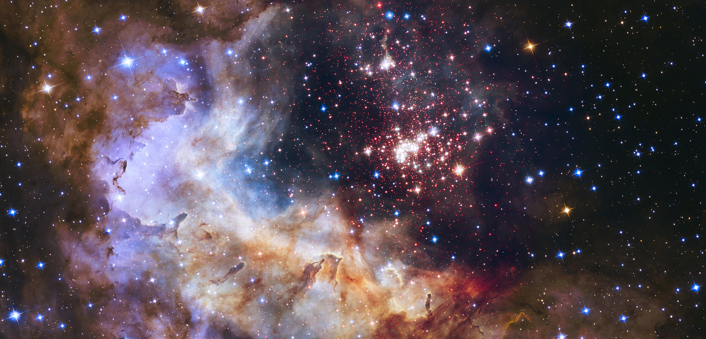
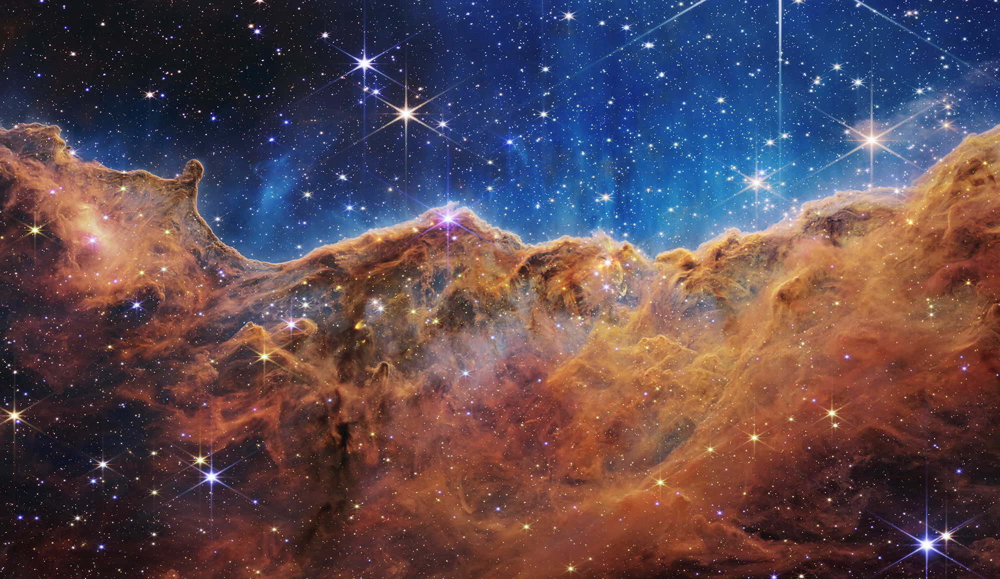

# Hubble & Webb observation-image tests

[English](#english) · [简体中文](#简体中文) · [日本語](#日本語)

## English

**Both official telescope images import correctly; neither blind-solves with
the current wide-field pattern database.** These are real observation
composites, not AI illustrations. They are shown as test inputs, not successful
annotation output. No manually supplied coordinates or fabricated overlays
were used.

| Official test input | Hubble — Westerlund 2 / Gum 29 | Webb — Cosmic Cliffs / NGC 3324 |
|---|---|---|
| Image |  |  |
| Downloaded display rendition | JPEG, 2000 × 960, 772,226 bytes | PNG, 2000 × 1158, 3,493,524 bytes |
| Native decoder | Passed, 8-bit, dimensions retained | Passed, 8-bit, dimensions retained |
| Pipeline outcome | No reliable solution | No reliable solution |
| Measured pipeline elapsed time | 47.085 seconds | 47.376 seconds |
| Source | [NASA Hubble record](https://science.nasa.gov/asset/hubble/westerlund-2-2/) | [NASA Webb record](https://science.nasa.gov/asset/webb/cosmic-cliffs-in-the-carina-nebula-nircam-image/) |
| Credit | NASA, ESA, A. Nota (ESA/STScI), and the Westerlund 2 Science Team | NASA, ESA, CSA, STScI |

The fixture files are the official display renditions downloaded unchanged on
2026-09-10, not full-resolution masters or raw telescope exposures. Full source
downloads remain available from the linked NASA pages. The
[source manifest](../tests/network-fixtures/TELESCOPE_SOURCES.json) records
exact download URLs, variants, sizes and SHA-256 hashes.

### What was actually tested

- Application code: `98f25a81cd3ba7f7cfc8ecf86572df3b94a4086a` (v1.3.0).
- Windows, Python 3.12.14; run started 2026-09-10 00:52:03 Asia/Shanghai
  (2026-09-09 16:52:03 UTC).
- Each input passed the real native decoder, followed by
  `backend.pipeline.analyze_image` with default settings and a generic filename.
  No NASA coordinates, field sizes or target names were passed as solve hints.
- Both reached image validation and star-pattern solving, then returned the
  normal “no reliable celestial solution” error at the 45-second search
  budget. Wall time includes decoding, copying and other pipeline overhead;
  these are individual measurements, not performance guarantees.
- Neither reached catalogue projection or annotation export. Therefore this
  test does **not** verify full-resolution annotated export for these two files.
  Temporary job files were cleaned after the run.
- Separate backend regression run: **123 discovered, 121 passed, 2 skipped**,
  12.739 seconds, no failures. The skipped opt-in cases are not counted as passes.
  The two telescope pipeline runs above were executed separately, not skipped.

### Why these images are outside the current solve range

The default tetra3 pattern database targets approximately 10°–30° fields.
Cropping is useful for wider camera fields, but cannot turn an already tiny
telescope field into a wide field. NASA gives the Webb image width as
7.3 arcminutes, about 0.122°; image pixel count is not angular coverage.
The result documents a current limitation, not successful Hubble/Webb
identification. Dedicated narrow-field pattern data and independent
astrometric validation are needed before that capability can be claimed.

### Reproduce offline

After the normal project dependency setup, run from the repository root:

```powershell
python scripts/benchmark_telescope_images.py
python -m unittest discover -s tests -p test_telescope_fixtures.py -v
```

The benchmark verifies input hashes, calls the actual pipeline, reports JSON
to stdout and progress to stderr, and cleans temporary results. Exit code 0
means both **expected rejections** were reproduced, not that the pictures were
solved. Any unexpected solution is recorded for independent review and causes
a nonzero exit; unrelated exceptions are not accepted as expected failures.
The small unit test checks fixture integrity and decoding without spending
another 90 seconds on blind solving. No runtime network access is needed.

Images retain their individual institutional credits and the
[NASA media usage guidelines](https://www.nasa.gov/nasa-brand-center/images-and-media/).
They are not relicensed under the application's GPL. NASA and its partners
have not endorsed the application. See [third-party notices](../THIRD_PARTY_NOTICES.md).

## 简体中文

两张图均为 NASA 官方发布的真实观测合成图，**读取成功，但当前版本盲解失败**。
主页展示的是测试输入，不是软件成功标注效果，更没有用网页坐标手工套上标签。

| 样本 | 文件与解码 | 完整流程调用结果 |
|---|---|---|
| 哈勃 Westerlund 2 | 2000 × 960 JPEG，8 位，读取成功 | 47.085 秒后返回无可靠解 |
| 韦伯“宇宙悬崖” | 2000 × 1158 PNG，8 位，读取成功 | 47.376 秒后返回无可靠解 |

2026-09-10 在 Windows、Python 3.12.14 下调用 v1.3.0 的真实分析流程，未提供
目标名、人工赤经赤纬或视场提示。两张图均在 45 秒搜索预算耗尽后正常报错；
总耗时还包含解码等开销，并非平均速度或时间保证。没有进入目录匹配与标注导出，
所以不能把“能读取”称为“能识别”，也不能据此宣称已验证这两张图的标注导出。

内置盲解索引主要针对约 10°–30° 宽场；韦伯此图宽度只有 7.3 角分，约 0.122°。
扩大显示像素或中央裁切不能补足这个角尺度差距。后续需要专用窄场索引和独立
天文定位校验，才能真正支持这类照片。

仓库保存的是未经改动的**官方显示版**，并非最高分辨率母版或望远镜 RAW。
上表中的 NASA 链接提供原始出处和下载入口；[来源清单](../tests/network-fixtures/TELESCOPE_SOURCES.json)
记录下载地址、尺寸及校验值。署名分别为 NASA、ESA、A. Nota（ESA/STScI）及
Westerlund 2 科学团队，以及 NASA、ESA、CSA、STScI。

上面的命令可离线复跑。脚本退出码 0 表示复现了“预期不支持”，不是识别成功；
意外输出坐标会要求独立校验。同期后端回归共发现 123 项，**121 项通过、2 项跳过**，
没有失败；两张望远镜照片已另行真实运行。此次更新只增加公开测试素材、复跑脚本
和英中日说明，不更换 v1.3.0 安装包，不包含尚未审核的 UI 设计稿。

## 日本語

NASA の実観測合成画像 2 枚を使い、**読み込み成功とブラインド解析失敗を分けて記録**
しました。Hubble は 2000 × 960 JPEG、Webb は 2000 × 1158 PNG、いずれも
8-bit でデコードできました。実際の分析処理は、それぞれ 47.085 秒、47.376 秒で
信頼できる解がないというエラーを返しました。注釈成功例ではありません。

テストは 2026-09-10、Windows / Python 3.12.14、v1.3.0 のコードで実行しました。
天体名・座標・画角をヒントとして渡していません。45 秒の探索予算にデコード等の
時間が加わります。カタログ投影や注釈書き出しには到達しておらず、この 2 枚の
注釈付きエクスポートを検証したとは主張しません。

内蔵索引は約 10°〜30° の広角向けです。Webb 画像は横幅 7.3 分角（約 0.122°）で、
狭視野用の索引と独立した位置検証が必要です。画像の画素数を増やすだけでは
この差は解消しません。

収録画像は未加工の公式表示版で、最高解像度マスターや RAW 観測データでは
ありません。上の表の NASA 出典、クレジット、[ハッシュ付き一覧](../tests/network-fixtures/TELESCOPE_SOURCES.json)
を参照してください。上記コマンドでオフライン再実行できます。終了コード 0 は
期待される拒否を再現した意味であり、解析成功ではありません。

別途実行した回帰テストは 123 件中 **121 件成功、2 件スキップ**、失敗なしでした。
今回の変更は公開テスト画像・スクリプト・三言語資料のみです。
v1.3.0 実行ファイルや未承認の UI デザインは変更していません。
