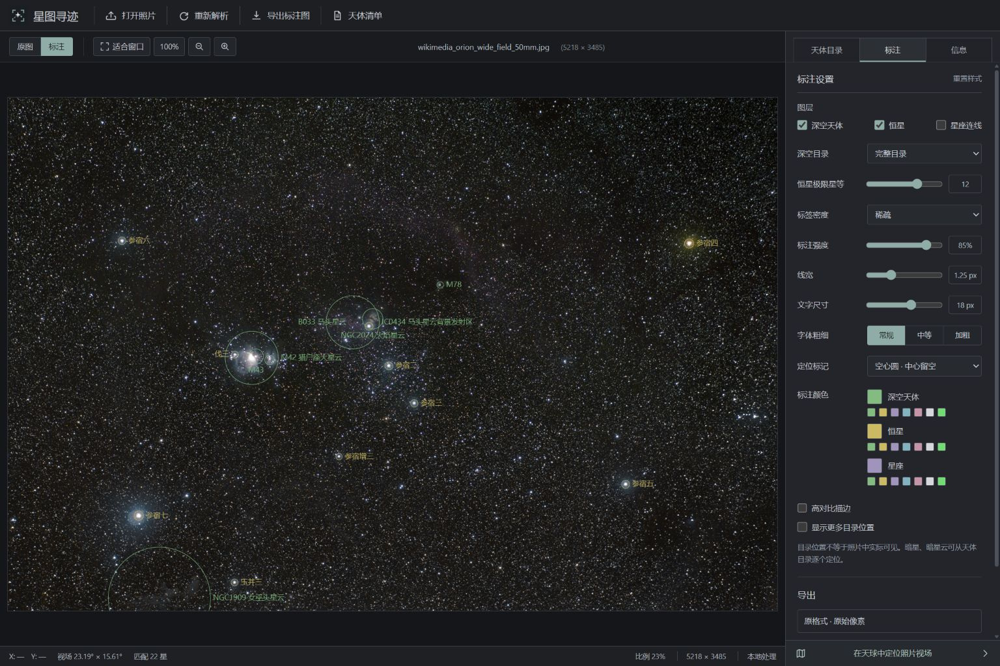
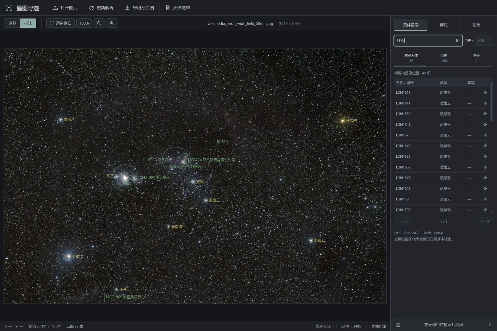

# Workbench and packaged application verification — 1.2.0

Verified on Windows on 2026-09-08. The displayed Orion image is the real
Wikimedia photograph credited in the repository's source record.

## Automated and packaged checks

- The complete backend suite passed **92 / 92** tests with `RUN_RAW_TESTS=1`.
- TypeScript checking and the Vite production build passed.
- The newly built Windows executable reports version **1.2.0** and serves the
  working local API. Tests below ran against that executable, not a source server.

| Packaged test | Result |
| --- | --- |
| Original Orion JPEG | 5218 × 3485, 103 deep-sky catalogue entries, 1,260 stars; 2.23 s |
| Style-only export | No new solve; JPEG at 5218 × 3485, corner marks; 0.53 s |
| Real Orion photo re-encoded as RGB16 TIFF | Full analysis and native uint16 TIFF output; 1.61 s |
| Same real photo re-encoded as RGB16 PNG | Full analysis and native uint16 PNG output; 3.73 s |
| Genuine Nikon D3S NEF | LibRaw decode reached the solve stage, then cancellation returned 499; 1.84 s |

The converted TIFF/PNG inputs test codec precision and packaging, not additional
sensor dynamic range. In these two lossless output checks, 99.5021% of pixels
were bit-for-bit unchanged; the remainder were annotation pixels. Downloaded
originals matched their upload SHA-256. The aurora NEF is a decode/cancellation
test, not a successful blind-solve claim. See [RAW details](RAW_AND_EXPORT.md).

## Browser interaction checks

Codex's in-app browser tested the real source application at desktop 1536 × 1024
and mobile 390 × 844. No Playwright fallback browser was needed.

- File chooser upload completed with a real photo, backend progress and results.
- Full catalogue pagination retained all 1,260 in-field stars. Searching and
  locating HIP 27431 (V=7.08) added a hollow selection marker at its position.
- Searching LDN returned 40 dark clouds in the same photograph.
- Circle/corner marks, constellation toggles, original/annotation switching,
  fit and 100% controls worked. SVG marked objects contained zero filled circles.
- Style-only export triggered an actual download; no full-resolution browser
  canvas or image Blob is needed for the native annotation download.
- The sky-view button opened the inward-looking sky with the solved photo
  footprint (23.19° × 15.61°); close returned to the photo.
- Mobile layout stacked the photograph and inspector, with no horizontal page
  overflow. All inspector controls remain scrollable.
- No browser console errors appeared during the photo workflow.

## Visual comparison record

The generated concept was only a workbench layout reference. The final desktop
and mobile browser screenshots were inspected as image files against that
concept, and annotation styling was subsequently adjusted to the user's real
reference photographs.

| Area | Verification / correction |
| --- | --- |
| Layout | Slim 48 px toolbar, image-dominant canvas, 330 px inspector, compact bottom status |
| Typography | Deliberate compact system UI text, readable controls and coordinates |
| Palette | Neutral dark workbench; user-requested moderate green/yellow/purple annotation |
| Photo treatment | Actual un-tinted source photograph; an outline replaced a border to remove a 2 px coordinate inset |
| Marks | Transparent centres and endpoint gaps; removed dots, glows and default heavy strokes |
| Text interaction | Canvas labels no longer become blue text selections during dragging |
| Responsive layout | Mobile has stacked panels, accessible scrolling and no horizontal overflow |
| Copy | Tool commands only; descriptive labels reflect actual formats, catalogue semantics and preview limits |

Intentional differences from the early concept: the user's latest reference sets
85% opacity, 18 px type and 1.25 px strokes (per 1920 px photo width), replacing
the earlier overly faint 55%/12 px proposal. The real photograph determines its
aspect ratio and object positions; concept star placements were never used as
astronomical evidence. Existing sky/NASA features and additional supported marker
controls remain available. The final layout and interactions were verified
against the design direction and these explicit user refinements.

